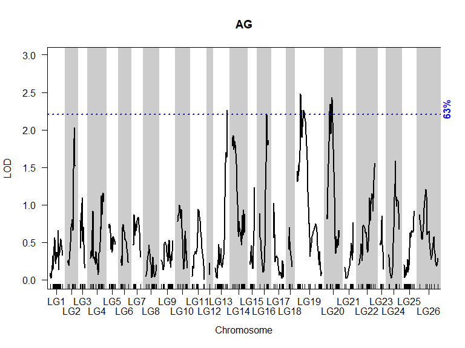
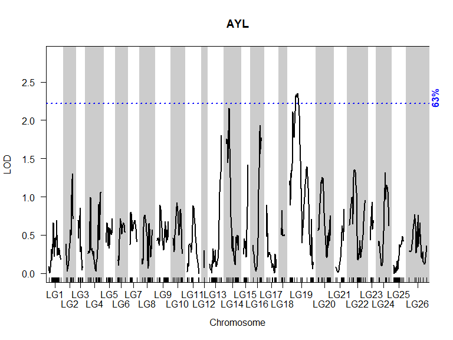

Genetic Mapping and QTL Analysis
================


Load packages

``` r
library(qtl)
library(ASMap)
library(dplyr)
library(corrplot)
```

    ## Warning: package 'corrplot' was built under R version 4.2.3

``` r
library(LinkageMapView)
```

Import genotypic data. for now, all markers are on 1 chr

``` r
data<-read.cross("csvr",".","raw_data.csv",genotypes=c("a","h","b"),map.function="kosambi")
```

    ##  --Read the following data:
    ##   152  individuals
    ##   791  markers
    ##   14  phenotypes

    ## Warning in summary.cross(cross): Some chromosomes > 1000 cM in length; there may be a problem with the genetic map.
    ##   (Perhaps it is in basepairs?)

    ##  --Cross type: f2

Convert cross to bcsft type f2 to use ASMap package

``` r
data<-convert2bcsft(data,F.gen=2,estimate.map=F)
cat("Phenos:")
```

    ## Phenos:

``` r
cbind(head(phenames(data),-1))
```

    ##       [,1]      
    ##  [1,] "AFF"     
    ##  [2,] "AFS"     
    ##  [3,] "AFL"     
    ##  [4,] "AG"      
    ##  [5,] "AYS"     
    ##  [6,] "AYL"     
    ##  [7,] "FOB1"    
    ##  [8,] "FOB2"    
    ##  [9,] "FOB3"    
    ## [10,] "F_AUDPC" 
    ## [11,] "Cold"    
    ## [12,] "FOB3_bin"
    ## [13,] "BDM"

``` r
n<-11 #normal phenotypes count
```

# Data Pre-processing

Look at the pattern of missing data. Black pixels indicate missing
genotypes.

``` r
plotMissing(data)
```

<!-- -->

Omit the individuals with more than 85% of total markers -\> less than
672 markers. Briefly estimate map first.

``` r
data<-quickEst(data,map.function="kosambi")
sg<-statGen(data,bychr=F,stat.type="miss",id='index')
data1<-subset(data,ind=om<-sg$miss<(totmar(data))*0.85)
cat(if(F%in%om) which(!om)else "no","ind omitted for missing > 85% mar")
```

    ## no ind omitted for missing > 85% mar

Plot the number of genotyped markers per individual as well as the
number of genotyped individuals per marker

``` r
par(mfrow=c(1,2), las=1)
plot(ntyped(data1), ylim=c(0,totmar(data1)+50),ylab="No. typed markers",main="Markers by Individual")
mtext("A",adj=0)
plot(ntyped(data1, "mar"), ylim=c(0,(nind(data1)+15)),ylab="No. typed individuals",main="Individuals by Marker")
mtext("B",adj=0)
```

<!-- -->

Plot the genotype frequencies per individual

``` r
g <- pull.geno(data1)
gfreq <- apply(g, 1, function(a) table(factor(a, levels=1:3)))
gfreq <- t(t(gfreq) / colSums(gfreq))
par(mfrow=c(1,3), las=1)
for(i in 1:3){
  plot(gfreq[i,], ylab="Genotype frequency",ylim=c(0,1))
  abline(h=mean(gfreq[i,]),lty=3,col="red",lwd=3)
  mtext(c("AA", "AB", "BB")[i])}
par(mfrow=c(1,1));title("Genotypes' Frequency and Segregation Ratio",line = 2.5)
```

<!-- -->

Compare the genotypes for all pairs of individuals

``` r
cg<-comparegeno(data1);cgr<-cg[lower.tri((cg))]
hist(cgr, breaks=seq(0, 1, len=101),xlab="No. matching genotypes", main="Matching Pairs of Individuals")
rug(cgr)
#mark the outlier with a red arrow 
x<-max(cgr)
arrow.plot(x,50,0,-1,true.angle = T,arrow.ex=30, length=.1,col='red', lwd=2)
text(x,70,paste0(round(100*x,1),"%"),adj=c(0.5,0.2))
```

<!-- -->

Omit individuals with more than 90% identical markers

``` r
wh<-which(cg>0.9,arr=T)
data2<-subset(data1,ind=-wh[,2])
cat(nind(data1)-nind(data2),"ind omitted for",paste0(round(100*x,1),"%"),"identical geno\n",paste0("#", data1$pheno$index[wh[,2]]))
```

    ## 2 ind omitted for 96.9% identical geno
    ##  #132 #134

Pull out markers from cross temporarily

``` r
cat(totmar(data2),'total mar\n')
```

    ## 791 total mar

``` r
data3<-pullCross(data2,type="missing",pars=list(miss.thresh=0.1))
cat(totmar(data3),'total mar\n')
```

    ## 760 total mar

``` r
cat(totmar(data2)-totmar(data3),"mar pulled for missing\n")
```

    ## 31 mar pulled for missing

``` r
data4<-pullCross(data3,type="seg.distortion",pars=list(seg.thresh=0.001))
cat(totmar(data4),'total mar\n')
```

    ## 726 total mar

``` r
cat(totmar(data3)-totmar(data4),"mar pulled for seg. distortion\n")
```

    ## 34 mar pulled for seg. distortion

``` r
data5<-pullCross(data4,type="co.located")
cat(totmar(data5),'total mar\n')
```

    ## 567 total mar

``` r
cat(totmar(data4)-totmar(data5),"mar pulled for co. located")
```

    ## 159 mar pulled for co. located

Plot optional p. values to determine distance threshold for marker
clustering. I chose pValue= 1e-7 (on y axis), meaning-\>\> split linkage
groups with more than 30cM gap between markers, according to 150 ind
population (on x axis)

``` r
cat(nind(data5),"individuals are used to cluster markers")
```

    ## 150 individuals are used to cluster markers

``` r
pValue(dist=seq(25,40,by=5),pop.size=110:190)
```

<!-- -->

LOD(Logarithm of the Odds)= statistical measure of the likelihood that
two loci (positions on a chromosome) are linked and therefore inherited
together, rather than assorting independently.

# Map Construction

Form linkage groups with LOD=7, raw map

``` r
data5<-mstmap(data5,bychr=F,p.value=1e-7,id='index')
```

    ## Number of linkage groups: 28
    ## The size of the linkage groups are: 39   32  47  33  27  12  19  10  38  18  28  19  27  8   11  40  11  13  24  17  16  20  17  1   21  1   16  2   
    ## The number of bins in each linkage group: 34 23  35  26  20  9   13  8   30  14  25  15  20  8   10  35  11  11  18  14  14  13  17  1   20  1   12  2   

``` r
plotMap(data5,alternate.chrid = T)
```

<!-- -->

Profile individuals’ genotype statistics

Omit missing/ double crossover (dxo)/ xo statistics outlier individuals

``` r
data6<-subsetCross(data5,ind=!pg$xo.lambda)
cat(nind(data5)-nind(data6),"ind omitted by profileGen")
```

    ## 1 ind omitted by profileGen

Double check dxo. An unusually high rate of double crossovers might
indicate genotyping errors

``` r
pg1<-profileGen(data6,bychr=F,stat.type=c("xo","dxo","miss"),id="index",xo.lambda=median(pg1$stat$xo),layout=c(1,3),lty=2,cex=0.7)
```

<!-- -->

Re-construct map. The genotyping errors can distort the distances
between markers, the order of the inputted markers is respected

``` r
data7<-mstmap(data6,bychr=F,anchor=T,p.value=1e-7,id='index')
```

    ## Number of linkage groups: 28
    ## The size of the linkage groups are: 39   18  28  19  27  8   11  40  11  13  24  32  17  16  20  17  1   21  1   16  2   47  33  27  12  19  10  38  
    ## The number of bins in each linkage group: 33 14  25  15  20  8   10  35  11  11  17  22  14  13  13  16  1   20  1   12  2   35  26  19  9   13  8   30  

Push back markers to the map

``` r
cat(totmar(data7),'total mar ')
```

    ## 567 total mar

``` r
data8<-pushCross(data7,type="co.located")
cat(totmar(data8),'total mar ')
```

    ## 726 total mar

``` r
cat(totmar(data8)-totmar(data7),"mar pushed for co. located")
```

    ## 159 mar pushed for co. located

Re-construct final map by adding markers to existing LGs (linkage
groups)

Drop LGs with less than 2 markers

``` r
mndrop<-markernames(data9,nmar(data9)<2)
data10<-drop.markers(data9,as.character(mndrop))
cat(totmar(data10),'total mar')
```

    ## 724 total mar

``` r
cat(totmar(data9)-totmar(data10),"mar omitted for LG < 2 mar")
```

    ## 2 mar omitted for LG < 2 mar

Rename chr by numerical order

``` r
x<-1:nchr(data10)
for (i in x) {names(data10$geno)[i]<-paste0("LG",i)}
```

Plot genetic map illustration, final map

``` r
plot.map(data10,alternate.chrid=T)
```

<!-- -->

LGs summary table

``` r
summaryMap(data10)
```

    ##         n.mar length ave.spacing max.spacing
    ## LG1        66   58.5         0.9        12.8
    ## LG2        13   34.4         2.9        14.6
    ## LG3        24   22.3         1.0         4.7
    ## LG4        33   64.0         2.0        11.5
    ## LG5        22   29.9         1.4         6.3
    ## LG6        23   36.1         1.6        15.2
    ## LG7        20   33.8         1.8        21.9
    ## LG8        26   48.9         2.0        11.2
    ## LG9        29   52.6         1.9        17.0
    ## LG10       18   43.9         2.6         8.9
    ## LG11       16   56.6         3.8        25.6
    ## LG12        2    1.9         1.9         1.9
    ## LG13       67   56.7         0.9         9.9
    ## LG14       34   58.7         1.8        10.8
    ## LG15       47   20.8         0.5         4.5
    ## LG16       12   41.1         3.7        18.5
    ## LG17       19   46.6         2.6        10.4
    ## LG18       10   15.7         1.7         8.5
    ## LG19       53  114.3         2.2        23.2
    ## LG20       44   60.7         1.4        14.4
    ## LG21       19   40.9         2.3        19.6
    ## LG22       27   77.1         3.0        14.7
    ## LG23        8   14.9         2.1         4.1
    ## LG24       11   49.3         4.9        26.9
    ## LG25       70   47.8         0.7         6.5
    ## LG26       11   86.3         8.6        28.8
    ## overall   724 1213.7         1.7        28.8

# Map Evaluation

Estimate recombination fraction

``` r
data10<-est.rf(data10)
```

Heatmap of LOD and Rf

``` r
heatMap(data10,lmax = 70,main='')
mtext("Pairwise Recombination Fractions and LOD Scores",cex=1.1,line=3.2,adj=0.4,font=2)
```

<!-- -->

Plot Pairwise LOD vs. Rf

``` r
rf<-pull.rf(data10);lod<-pull.rf(data10,what="lod")
plot(as.numeric(rf),as.numeric(lod),xlab="Recombination fraction",ylab="LOD score",main=paste("Pairwise LOD vs. Rf for",totmar(data10),"Markers"))
```

<!-- -->

The evaluation looks good:

The heatmap is continuous with low gradient along the chr meaning that
the markers within a chromosome are gradually distant from each other.

On the LOD/rf scatter plot there is a trend line with no outliers.

# Exploratory Data Analysis

Jitter map- to avoid marker overlaping by slightly adding gaps between
them

``` r
data<-jittermap(data10)
```

Create a df of parents phenotype

``` r
cold_values <- c(5, 5, 4, 6, 7, 9, 5, 6, 6, 7, NA, NA, 7, 8, 7, 8, 8, 8, 9, 9, 9, 8, NA, NA)
faudpc_values <- c(rep(0, 12), rep(c(90, 142), each = 6))
parents <- data.frame(rbind(matrix(0,12,9), matrix(5,12,9)),faudpc_values, Cold = cold_values,row.names = c(paste0("P1_", 1:12), paste0("DP_", 1:12)))
ant_values <-c(5, 4.5, 4.5, 4.5, 4.5, 3.5, 4, 4.5, 4, 4.5, 4, 4)
parents[13:24,1:3] <-matrix(ant_values,12,3)
colnames(parents) <-phenames(data)[1:n]
```

Check the phenotypic distribution

Plot histograms or barplots

``` r
cbind(phenames(data)) 
```

    ##       [,1]      
    ##  [1,] "AFF"     
    ##  [2,] "AFS"     
    ##  [3,] "AFL"     
    ##  [4,] "AG"      
    ##  [5,] "AYS"     
    ##  [6,] "AYL"     
    ##  [7,] "FOB1"    
    ##  [8,] "FOB2"    
    ##  [9,] "FOB3"    
    ## [10,] "F_AUDPC" 
    ## [11,] "Cold"    
    ## [12,] "FOB3_bin"
    ## [13,] "BDM"     
    ## [14,] "index"

<!-- --><!-- --><!-- -->

Plot the correlation matrices using corrplot

``` r
mat<-cor(pull.pheno(data,c(1:10,12,13,11)),use = "complete.obs")
corrplot(mat,type = 'upper',method = "color", addCoef.col = "orange", tl.col = "black", tl.srt = 35,tl.cex=0.7,number.cex=0.5) 
```

<!-- -->

Now, for each group of phenotypes

Fusarium

``` r
mat<-cor(pull.pheno(data,c(7:10,12)),use = "complete.obs")
corrplot(mat, type='upper',method = "color", addCoef.col = "white", tl.col = "black", tl.srt = 35)
```

<!-- -->

Anthocyanin

``` r
mat<-cor(pull.pheno(data,1:6),use = "complete.obs")
corrplot(mat, type='upper',method = "color", addCoef.col = "white", tl.col = "black", tl.srt = 35)
```

<!-- -->

There is a strong correlation between the phenotypes in the same group.
the different conditions (in anthocyanin) or repetitions (in fusarium)
had a limited effect on the resulting phenotype.

# QTL Analysis

Perform genome scans to identify QTL

    ## Loading precomputed genome scans from genome_scans.Rdata, scan2_part1.Rdata and scan2_lod_part2.Rdata to save time.

Setting a QTL detection threshold according to permutation tests. The
lower the precentage (5%), the better significance of the QTL.

``` r
(thresh1.hk<-summary(scan1perm,alpha=c(0.63,0.1,0.05))) 
```

    ## LOD thresholds (1000 permutations)
    ##      AFF  AFS  AFL   AG  AYS  AYL FOB1 FOB2 FOB3 F_AUDPC Cold
    ## 63% 2.24 2.24 2.22 2.21 2.24 2.22 2.24 2.22 2.25    2.24 2.26
    ## 10% 3.30 3.29 3.28 3.26 3.31 3.35 3.40 3.38 3.28    3.36 3.33
    ## 5%  3.66 3.65 3.66 3.63 3.66 3.65 3.71 3.74 3.64    3.75 3.67

``` r
(thresh2.em<-summary(scan1perm.bin,alpha=c(0.63,0.1,0.05)))
```

    ## LOD thresholds (1000 permutations)
    ##     FOB3_bin  BDM
    ## 63%     2.21 2.26
    ## 10%     3.29 3.40
    ## 5%      3.54 3.88

Scan for additional QTL after reducing the masking effect of QTL with
major peaks.

Threshold colors

``` r
thcol<-c('blue','green','red')
```

Plot LOD curves per phenotype, QTL peaks

``` r
for(i in 1:(length(phenames(data))-3)){
  p<-phenames(data)[i]
  plot(scan1,lodcolumn=i,main=p,ylab="LOD",bandcol="gray80",ylim=c(0,max(scan1[,2+i])+0.5),alternate.chrid = T)
    abline(h=thresh1.hk[,i],lty='dotted',lwd=2,col=thcol)
    for(j in 1:3){
      if(thresh1.hk[j,i]/par('usr')[4]<1){
        mtext(rownames(thresh1.hk)[j],side=4,font=2,adj=thresh1.hk[j,i]/(par('usr')[4]-0.2),col=thcol[j])
      }
    }
}
```

<!-- --><!-- --><!-- --><!-- --><!-- --><!-- --><!-- --><!-- --><!-- --><!-- --><!-- -->

``` r
for(i in 1:2){
  p<-phenames(data)[i+n]
  plot(scan1.bin,lodcolumn=i,main=p,ylab="LOD",bandcol="gray80",ylim=c(0,max(scan1.bin[,2+i])+0.5),alternate.chrid = T)
    abline(h=thresh2.em[,i],lty='dotted',lwd=2,col=thcol)
    for(j in 1:3){
      if(thresh2.em[j,i]/par('usr')[4]<1){
        mtext(rownames(thresh2.em)[j],side=4,font=2,adj=thresh2.em[j,i]/(par('usr')[4]-0.2),col=thcol[j])
      }
    }
}
```

<!-- --><!-- -->

The add QTL scan found nothing

``` r
#normal
qtlist<-summary(scan1,perms=scan1perm,format="tabByCol",alpha=0.95,ci.function="bayesint",pvalues=T)
  data<-calc.genoprob(data,2,map.function="kosambi")
  qtlist.aq<-list()
  s.aq<-list()
  for (i in 1:n){
    p<-phenames(data)[i]
    if(!is.null(out.aq[[p]])){
      s<-summary(out.aq[[p]],format="tabByCol",perms=scan1perm[,p],alpha=0.95,ci.function="bayesint",pvalues=T)
      if(nrow(s[[1]])>0){
        qtlist.aq[p]<-s
        qtlist.aq[[p]]<-cbind.data.frame(Trait=p,qtlist.aq[[p]])
        s.aq[[p]]<-summary(out.aq[[p]],perms=scan1perm[,p],alpha=0.63)
        if(nrow(s.aq[[p]])>0){
          rqtl[[p]]<-addtoqtl(data,rqtl[[p]],s.aq[[p]][,1],s.aq[[p]][,2])
        }
      }
    }
  }
  for (i in 1:length(qtlist)){
    if(colnames(qtlist[[i]])[1]!="Trait"){
      qtlist[[i]]<-cbind.data.frame(Trait=names(qtlist[i]),qtlist[[i]])
    }
  }
  qtldf<-do.call(rbind.data.frame,c(qtlist,make.row.names=F))
  
  for (i in 1:n){
    if(names(qtlist[i])%in%names(qtlist.aq)){
      qtlist[[i]]<-rbind(qtlist[[i]],qtlist.aq[[phenames(data)[i]]])
    }
  }
  qtldf.aq<-do.call(rbind.data.frame,c(qtlist,make.row.names=F))
  
  #binary
  qtlist<-summary(scan1.bin,perms=scan1perm.bin,format="tabByCol",alpha=0.95,ci.function="bayesint",pvalues=T)
  data<-calc.genoprob(data,3,map.function="kosambi")
  for (i in 1:2){
    p<-phenames(data)[i+n]
    if(!is.null(out.aq.bin[[p]])){
      s<-summary(out.aq.bin[[p]],perms=scan1perm.bin[,p],alpha=0.95,format="tabByCol",ci.function="bayesint",pvalues=T)
      if(nrow(s[[1]])>0){
        qtlist.aq[p]<-s
        qtlist.aq[[p]]<-cbind.data.frame(Trait=p,qtlist.aq[[p]])
        s.aq[[p]]<-summary(out.aq.bin[[p]],perms=scan1perm.bin[,p],alpha=0.63)
        if(nrow(s.aq[[p]])>0){
          rqtl.bin[[p]]<-addtoqtl(data,rqtl.bin[[p]],s.aq[[p]][,1],s.aq[[p]][,2])
        }
      }
    }
  }
  for (i in 1:length(qtlist)){
    qtlist[[i]]<-cbind.data.frame(Trait=names(qtlist[i]),qtlist[[i]])
  }
  for (i in 1:length(qtlist)){
    qtldf<-rbind.data.frame(qtldf,qtlist[[i]],make.row.names=F)
  }
  for (i in 1:2){
    if(names(qtlist[i])%in%names(qtlist.aq)){
      qtlist[[i]]<-rbind(qtlist[[i]],qtlist.aq[[phenames(data)[i+n]]])
    }
  }
  qtldf.aq.bin<-do.call(rbind.data.frame,c(qtlist,make.row.names=F))
  qtldf.aq<-rbind(qtldf.aq,qtldf.aq.bin)
```

QTL summary as dataframe for final report. QTL at alp= 0.99 and sig
\*\*\* levels

``` r
su<-1-summary(data)$missing.phe
qtldf.aq<-qtldf.aq%>%
  mutate("Len of LG"=round(chrlen(data)[chr],1),.after=chr)%>%
  mutate("Len of QTL"=round(ci.high-ci.low,1),.after="Len of LG")%>%
  mutate("Flanking markers"=paste0(chr,"_m",find.marker(data,chr,ci.low),"-",chr,"_m",find.marker(data,chr,ci.high)))%>%
  mutate("Central marker"=paste0(chr,"_m",find.marker(data,chr,pos)))%>%
  mutate("Pval"=paste0(pval,if_else(pval<0.63,"*",""),if_else(pval<0.1,"*",""), if_else(pval<0.05,"*","")))%>%
  select(!c(pval,ci.low,ci.high))%>%
  rename("QTL's LG"=chr)%>%
  mutate("No. Inds/% phenotyped"=paste0(nind(data)*su[find.pheno(data,Trait)]," ind / ",round(100*su[find.pheno(data,Trait)],1),"%"),.after=Trait)%>%
  mutate("pos"=round(pos,1))%>%
  mutate("lod"=round(lod,1))
qtldf.aq
```

    ##       Trait No. Inds/% phenotyped QTL's LG Len of LG Len of QTL  pos lod
    ## 1       AFF        149 ind / 100%     LG13      56.7       28.6 56.3 2.8
    ## 2       AFF        149 ind / 100%     LG14      58.7       57.2 12.0 2.6
    ## 3       AFF        149 ind / 100%     LG16      41.1       41.1 32.9 1.9
    ## 4       AFF        149 ind / 100%     LG17      46.6       32.0  1.1 1.9
    ## 5       AFF        149 ind / 100%     LG19     114.3       80.0 34.2 2.5
    ## 6       AFF        149 ind / 100%     LG20      60.7       26.0 18.0 2.9
    ## 7       AFF        149 ind / 100%     LG22      77.1       77.1 77.1 1.8
    ## 8       AFF        149 ind / 100%     LG24      49.3       22.0 31.7 3.1
    ## 9       AFS        149 ind / 100%     LG13      56.7       45.1 56.7 2.3
    ## 10      AFS        149 ind / 100%     LG14      58.7       52.4 12.0 2.7
    ## 11      AFS        149 ind / 100%     LG17      46.6       28.0  1.1 2.1
    ## 12      AFS        149 ind / 100%     LG19     114.3       82.0 34.2 2.5
    ## 13      AFS        149 ind / 100%     LG20      60.7       26.0 24.0 3.1
    ## 14      AFS        149 ind / 100%     LG24      49.3       22.0 31.7 3.3
    ## 15      AFS        149 ind / 100%     LG26      86.3       86.3  0.0 2.0
    ## 16      AFL        149 ind / 100%     LG13      56.7       17.1 56.3 2.8
    ## 17      AFL        149 ind / 100%     LG14      58.7       18.0  4.0 2.7
    ## 18      AFL        149 ind / 100%     LG16      41.1       15.1 32.9 2.3
    ## 19      AFL        149 ind / 100%     LG17      46.6       46.0  1.1 1.9
    ## 20      AFL        149 ind / 100%     LG19     114.3       80.8 36.0 2.5
    ## 21      AFL        149 ind / 100%     LG20      60.7       26.0 18.0 2.7
    ## 22      AFL        149 ind / 100%     LG24      49.3       22.0 31.7 2.8
    ## 23       AG        149 ind / 100%      LG2      34.4       22.4 31.4 2.0
    ## 24       AG        149 ind / 100%     LG13      56.7       41.7 56.3 2.3
    ## 25       AG        149 ind / 100%     LG14      58.7       58.0  4.0 1.9
    ## 26       AG        149 ind / 100%     LG16      41.1       41.1 32.9 2.2
    ## 27       AG        149 ind / 100%     LG19     114.3       48.0 15.9 2.5
    ## 28       AG        149 ind / 100%     LG20      60.7       26.0 24.0 2.4
    ## 29      AYS        149 ind / 100%     LG13      56.7       45.1 56.3 2.1
    ## 30      AYS        149 ind / 100%     LG16      41.1       41.1 34.0 1.9
    ## 31      AYS        149 ind / 100%     LG19     114.3       79.6 40.0 2.4
    ## 32      AYL        149 ind / 100%     LG13      56.7       56.7 56.3 1.8
    ## 33      AYL        149 ind / 100%     LG14      58.7       57.2 12.8 2.2
    ## 34      AYL        149 ind / 100%     LG16      41.1       17.1 34.6 1.9
    ## 35      AYL        149 ind / 100%     LG19     114.3       88.0 38.0 2.4
    ## 36     FOB1       117 ind / 78.5%      LG4      64.0       28.0  2.0 2.1
    ## 37     FOB1       117 ind / 78.5%     LG25      47.8       34.0  7.9 1.9
    ## 38     FOB2       118 ind / 79.2%     LG19     114.3       94.0 15.9 1.9
    ## 39     FOB2       118 ind / 79.2%     LG25      47.8       40.0  6.6 2.6
    ## 40     FOB3       118 ind / 79.2%      LG6      36.1       24.0 24.0 2.3
    ## 41     FOB3       118 ind / 79.2%     LG13      56.7       40.0 17.8 2.0
    ## 42     FOB3       118 ind / 79.2%     LG17      46.6       22.9 16.2 2.6
    ## 43     FOB3       118 ind / 79.2%     LG22      77.1       65.1 56.0 1.7
    ## 44     FOB3       118 ind / 79.2%     LG25      47.8       32.0  6.6 3.6
    ## 45  F_AUDPC       118 ind / 79.2%     LG25      47.8       32.0  6.6 3.1
    ## 46     Cold        149 ind / 100%     LG21      40.9       26.1 24.0 2.0
    ## 47 FOB3_bin       118 ind / 79.2%      LG6      36.1       22.0 27.0 2.5
    ## 48 FOB3_bin       118 ind / 79.2%      LG9      52.6       39.0 51.0 1.8
    ## 49 FOB3_bin       118 ind / 79.2%     LG13      56.7       56.7 17.8 2.1
    ## 50 FOB3_bin       118 ind / 79.2%     LG17      46.6       27.0 16.2 1.9
    ## 51 FOB3_bin       118 ind / 79.2%     LG20      60.7       60.7  3.0 1.9
    ## 52 FOB3_bin       118 ind / 79.2%     LG22      77.1       54.0 57.0 1.8
    ## 53 FOB3_bin       118 ind / 79.2%     LG25      47.8       17.3  6.6 4.5
    ## 54 FOB3_bin       118 ind / 79.2%     LG25      47.8       22.8 21.0 3.0
    ## 55      BDM        149 ind / 100%      LG6      36.1       26.0 27.0 3.1
    ## 56      BDM        149 ind / 100%     LG13      56.7       42.0 12.4 1.8
    ## 57      BDM        149 ind / 100%     LG19     114.3      108.0  8.4 2.7
    ## 58      BDM        149 ind / 100%     LG25      47.8       23.5 14.9 2.1
    ## 59      BDM        149 ind / 100%      LG6      36.1       13.9 10.1 2.4
    ##             Flanking markers Central marker     Pval
    ## 1  LG13_m213796-LG13_m152483    LG13_m95830   0.232*
    ## 2    LG14_m187879-LG14_m3973   LG14_m232116    0.34*
    ## 3     LG16_m98366-LG16_m1644   LG16_m256179    0.858
    ## 4     LG17_m66485-LG17_m2335    LG17_m26429    0.888
    ## 5     LG19_m62803-LG19_m3026   LG19_m164757   0.426*
    ## 6   LG20_m66136-LG20_m233715    LG20_m99144   0.207*
    ## 7   LG22_m172088-LG22_m55365    LG22_m55365    0.931
    ## 8  LG24_m115022-LG24_m158249   LG24_m115022   0.144*
    ## 9  LG13_m239247-LG13_m152483   LG13_m152483   0.608*
    ## 10 LG14_m187879-LG14_m140735   LG14_m232116   0.312*
    ## 11  LG17_m66485-LG17_m186932    LG17_m26429    0.762
    ## 12   LG19_m248944-LG19_m3026   LG19_m164757   0.432*
    ## 13  LG20_m66136-LG20_m233715   LG20_m249499   0.156*
    ## 14 LG24_m115022-LG24_m158249   LG24_m115022  0.097**
    ## 15  LG26_m228710-LG26_m99216   LG26_m228710    0.828
    ## 16 LG13_m116284-LG13_m152483    LG13_m95830   0.269*
    ## 17  LG14_m187879-LG14_m99155    LG14_m33308   0.303*
    ## 18   LG16_m256633-LG16_m1644   LG16_m256179   0.577*
    ## 19  LG17_m66485-LG17_m242212    LG17_m26429    0.895
    ## 20  LG19_m255575-LG19_m38508   LG19_m164757   0.423*
    ## 21  LG20_m66136-LG20_m233715    LG20_m99144   0.308*
    ## 22 LG24_m115022-LG24_m158249   LG24_m115022   0.269*
    ## 23    LG2_m27444-LG2_m221845     LG2_m23665    0.781
    ## 24 LG13_m110230-LG13_m152483    LG13_m95830   0.589*
    ## 25   LG14_m187879-LG14_m2633    LG14_m33308    0.837
    ## 26    LG16_m98366-LG16_m1644   LG16_m256179    0.639
    ## 27 LG19_m195831-LG19_m176482    LG19_m62803   0.461*
    ## 28  LG20_m66136-LG20_m233715   LG20_m249499    0.48*
    ## 29 LG13_m239247-LG13_m152483    LG13_m95830    0.734
    ## 30    LG16_m98366-LG16_m1644    LG16_m85999    0.833
    ## 31  LG19_m222416-LG19_m38508   LG19_m164757   0.532*
    ## 32 LG13_m131941-LG13_m152483    LG13_m95830    0.882
    ## 33   LG14_m187879-LG14_m3973   LG14_m232116    0.679
    ## 34   LG16_m256633-LG16_m1644    LG16_m85999    0.838
    ## 35  LG19_m195831-LG19_m38508   LG19_m164757   0.532*
    ## 36   LG4_m158167-LG4_m179103    LG4_m158167    0.703
    ## 37 LG25_m148704-LG25_m118219    LG25_m42909    0.871
    ## 38   LG19_m234493-LG19_m3026    LG19_m62803    0.859
    ## 39 LG25_m148704-LG25_m196841    LG25_m26868   0.333*
    ## 40    LG6_m249118-LG6_m34544     LG6_m51714   0.562*
    ## 41 LG13_m131941-LG13_m116284   LG13_m129765    0.814
    ## 42  LG17_m26429-LG17_m186932   LG17_m181813    0.38*
    ## 43  LG22_m204703-LG22_m55365     LG22_m3697     0.93
    ## 44 LG25_m148704-LG25_m198798    LG25_m26868  0.051**
    ## 45 LG25_m148704-LG25_m198798    LG25_m26868   0.158*
    ## 46  LG21_m78042-LG21_m103080   LG21_m168769    0.809
    ## 47    LG6_m102306-LG6_m34544     LG6_m51714   0.457*
    ## 48     LG9_m74935-LG9_m61458    LG9_m235200      0.9
    ## 49 LG13_m131941-LG13_m152483   LG13_m129765     0.71
    ## 50  LG17_m66485-LG17_m186932   LG17_m181813    0.856
    ## 51 LG20_m213579-LG20_m112128    LG20_m66136    0.832
    ## 52 LG22_m102393-LG22_m213924   LG22_m159568    0.897
    ## 53  LG25_m86542-LG25_m152494    LG25_m26868 0.007***
    ## 54 LG25_m148704-LG25_m108773   LG25_m121157   0.189*
    ## 55    LG6_m201323-LG6_m34544     LG6_m51714   0.158*
    ## 56 LG13_m131941-LG13_m116284    LG13_m32070    0.929
    ## 57 LG19_m195831-LG19_m251298   LG19_m234493   0.345*
    ## 58  LG25_m148704-LG25_m83002   LG25_m153207    0.749
    ## 59    LG6_m162041-LG6_m51714    LG6_m201323   0.514*

QTL pairs summary

``` r
#normal
c.thr1<-list()
for(i in 1:n){
  (thr1<-summary(scan2, perms=scan2perm, alpha=0.2,lodcolumn=i,pvalues=T))
  if(i==1){c.thr1[[phenames(data)[i]]]<-thr1
  }else c.thr1[[phenames(data)[i]]]<-thr1
}
for (i in 1:length(c.thr1)){
  if(nrow(c.thr1[[i]])>0&&colnames(c.thr1[[i]])[1]!="Trait"){
    c.thr1[[i]]<-cbind.data.frame(Trait=names(c.thr1[i]),c.thr1[[i]])
  }
}
thr1df<-do.call(rbind.data.frame,c(c.thr1,make.row.names=F))
#binary
c.thr2<-list()
for(i in 1:2){
  (thr2<-summary(scan2.bin, perms=scan2perm.bin, alpha=0.2,lodcolumn=i,pvalues=T))
  if(i==1){c.thr2[[phenames(data)[i+n]]]<-thr2
  }else c.thr2[[phenames(data)[i+n]]]<-thr2
}
for (i in 1:length(c.thr2)){
  if(nrow(c.thr2[[i]])>0&&colnames(c.thr2[[i]])[1]!="Trait"){
    c.thr2[[i]]<-cbind.data.frame(Trait=names(c.thr2[i]),c.thr2[[i]])
  }
}
thr2df<-do.call(rbind.data.frame,c(c.thr2,make.row.names=F))
thr<-rbind(thr1df,thr2df)
```

QTL pairs

``` r
#normal
data<-calc.genoprob(data,2,map.function="kosambi")
qtlist<-summary(scan1,perms=scan1perm,format="tabByCol",alpha=0.63,ci.function="bayesint")
sc2thr1<-summary(scan2perm,alpha=0.2)
#rearrange the threshold list
th<-vector('list',5)
for(j in 1:5){th[[j]]<-t(sc2thr1[[j]])}
m<-do.call('cbind',th)
dimnames(m)<-list(phenames(data)[1:n],names(sc2thr1)[1:5])
out.ap<-list();qtlpairs<-list();s.fq<-list();out.fq<-list()
for(i in 1:n){
  p<-phenames(data)[i]
  if(length(qtlist[[p]][,1])>0){
    out.ap[[p]]<-addpair(data,qtlist[[p]][,1],p,rqtl[[p]],method="hk",verbose=T)
    qtlpairs[[p]]<-summary(out.ap[[p]],thresholds=m[p,])
    s.fq[[p]]<-summary(out.fq[[p]]<- fitqtl(data,p,rqtl[[p]],method="hk",get.ests=T))
  }
}
```

    ## Warning in addpair(data, qtlist[[p]][, 1], p, rqtl[[p]], method = "hk", : Dropping 31 individuals with missing phenotypes.

    ## Warning in fitqtlengine(pheno = pheno, qtl = qtl, covar = covar, formula = formula, : Dropping 31 individuals with missing phenotypes.

    ## Warning in addpair(data, qtlist[[p]][, 1], p, rqtl[[p]], method = "hk", : Dropping 31 individuals with missing phenotypes.

    ## Warning in fitqtlengine(pheno = pheno, qtl = qtl, covar = covar, formula = formula, : Dropping 31 individuals with missing phenotypes.

    ## Warning in addpair(data, qtlist[[p]][, 1], p, rqtl[[p]], method = "hk", : Dropping 31 individuals with missing phenotypes.

    ## Warning in fitqtlengine(pheno = pheno, qtl = qtl, covar = covar, formula = formula, : Dropping 31 individuals with missing phenotypes.

``` r
#binary
data<-calc.genoprob(data,10,map.function="kosambi")
qtlist.bin<-summary(scan1.bin,perms=scan1perm.bin,format="tabByCol",alpha=0.63,ci.function="bayesint")
sc2thr2<-summary(scan2perm.bin,alpha=0.2)
#rearrange the threshold list
th<-vector('list',5)
for(j in 1:5){th[[j]]<-t(sc2thr2[[j]])}
m.bin<-do.call('cbind',th)
dimnames(m.bin)<-list(phenames(data)[n+1:2],names(sc2thr2)[1:5])
out.ap.bin<-list();rqtl2.bin<-list()
for(i in 1:2){
  p<-phenames(data)[i+n]
  if(length(qtlist.bin[[p]][,1])>0){
    q<-rbind(qtlist.bin[[p]][,-c(3,4)],s.aq[[p]])
    rqtl2.bin[[p]]<-refineqtl(data,p,makeqtl(data,q[,1],q[,2],what="prob"),maxit.fitqtl=1e+6,tol=0.05,method="hk",model="binary")
    out.ap.bin[[p]]<-addpair(data,q[,1],p,rqtl2.bin[[p]],maxit=1e+6,tol=0.2,method="hk",model="binary",verbose=T)
    qtlpairs[[p]]<-summary(out.ap.bin[[p]],thresholds=m.bin[p,])
    s.fq[[p]]<-summary(out.fq[[p]]<- fitqtl(data,p,rqtl2.bin[[p]],maxit=1e+6,tol=0.01,method="hk",model="binary",get.ests=T))
  }
}
```

    ## Warning in matchchr(chr, names(cross$geno)): Dropping duplicate chromosomes

    ## Warning in addpair(data, q[, 1], p, rqtl2.bin[[p]], maxit = 1e+06, tol = 0.2, : Dropping 31 individuals with missing phenotypes.

    ## Warning in fitqtlengine(pheno = pheno, qtl = qtl.obj, covar = covar, formula =
    ## formula, : Didn't converge.

    ## Warning in fitqtlengine(pheno = pheno, qtl = qtl, covar = covar, formula = formula, : Dropping 31 individuals with missing phenotypes.

    ## Warning in matchchr(chr, names(cross$geno)): Dropping duplicate chromosomes

``` r
for (i in 1:length(qtlpairs)){
if(nrow(qtlpairs[[i]])>0 && names(qtlpairs[[i]])[1]!="Trait"){
  qtlpairs[[i]]<-cbind.data.frame(Trait=names(qtlpairs[i]),qtlpairs[[i]])
  }
}
qtlpairsdf<-do.call(rbind.data.frame,c(qtlpairs,make.row.names=F))
##interacting QTL detected for AFL
qtlpairsdf<-c(qtlpairsdf,thr=m[qtlpairsdf[,1],])
```

One interactive QTL pair was found in the add pair scan for AFL
phenotype.

# Linkage Map view

``` r
alp<-0.63
colorlist<-RColorBrewer::brewer.pal(8,"Set1")
```

Genetic map to pdf

``` r
qtldf_initial<-\(){ 
  # make a df to pass qtl info
  qtldf <- data.frame(
    chr = character(),
    qtl = character(),
    so = numeric(),
    si = numeric(),
    ei = numeric(),
    eo = numeric(),
    col = character(),
    stringsAsFactors = F
  )
  return(qtldf)
}
outfile<-file.path("results/basil_linkage_map.pdf")
main<-"Basil Genetic Map"
qtldf<-qtldf_initial()

setting<-list(mapthis=data,outfile=outfile,main=main,ruler=T,maxnbrcolsfordups=2,dupnbr=T,lg.col='lightblue1',lgw=0.15,labdist=0.15,lgperrow=3)
do.call(lmv.linkage.plot,setting)
```

    ## Required pdf.width = 7.11466666666667

    ## Required pdf.height = 51.2411333333333

    ## Using pdf.width = 8

    ## Using pdf.height = 52

Anthocyanin QTL map

``` r
qtldf<-qtldf_initial()
for (i in 1:6) {
  qtls<-summary(scan1,perms=scan1perm,alpha=alp,lodcolumn=i)[,c(1:2,2+i)]
  if(nrow(qtls)>0){
    for (j in 1:nrow(qtls)) {
      bay <-bayesint(scan1[,c(1:2,2+i)],chr=qtls$chr[j])
      qtldf <- rbind(qtldf,
                     data.frame(
                       chr = qtls$chr[j],
                       qtl = colnames(bay)[3],
                       so = bay$pos[1],
                       si = bay$pos[2],
                       ei = bay$pos[2],
                       eo = bay$pos[3],
                       col=colorlist[(i+1)]))
    }
  }
}
outfile<-file.path("results/basil_QTLs.anthocyanin.pdf")
mapthese<-paste0("LG",sort(unique(as.numeric(qtldf$chr))))
main<-paste0("Basil Genetic Map + QTLs for Anthocyanin (",paste0(mapthese,collapse = ","),")")
setting<-modifyList(setting,list(outfile=outfile,mapthese=mapthese,main=main))
setting$qtldf<-qtldf
do.call(lmv.linkage.plot,setting)
```

    ## Required pdf.width = 12.865

    ## Required pdf.height = 14.6325333333333

    ## Using pdf.width = 13

    ## Using pdf.height = 15

Fusarium QTL map

``` r
qtldf<-qtldf_initial()
for (i in 7:10) {
  qtls<-summary(scan1,perms=scan1perm,alpha=alp,lodcolumn=i)[,c(1:2,2+i)]
  if(nrow(qtls)>0){
    for (j in 1:nrow(qtls)) {
      bay <-bayesint(scan1[,c(1:2,2+i)],chr=qtls$chr[j])
      qtldf <- rbind(qtldf,
                     data.frame(
                       chr = qtls$chr[j],
                       qtl = colnames(bay)[3],
                       so = bay$pos[1],
                       si = bay$pos[2],
                       ei = bay$pos[2],
                       eo = bay$pos[3],
                       col=colorlist[(i-5)]))
    }
  }
}
i<-1
p<-phenames(data)[i+n]
qtls<-summary(scan1.bin,perms=scan1perm.bin,format="tabByCol",alpha=alp,ci.function="bayesint")
if(nrow(qtls[[p]])>0){
for (j in 1:(nrow(qtls[[p]])+1)) {
    if(j==3){
      qtls[[p]]<-rbind(qtls[[p]],cbind(s.aq[[p]][,-3],`ci.low`=bayesint(out.aq.bin[[p]],s.aq[[p]][,1])[1,2],`ci.high`=bayesint(out.aq.bin[[p]],s.aq[[p]][,1])[3,2],`lod`=s.aq[[p]][,3]))
    }
    qtldf<-rbind(qtldf,
                 data.frame(
                   chr = qtls[[p]]$chr[j],
                   qtl = p,
                   so = qtls[[p]]$`ci.low`[j],
                   si = qtls[[p]]$pos[j],
                   ei = qtls[[p]]$pos[j],
                   eo = qtls[[p]]$`ci.high`[j],
                   col=colorlist[7]))
}
}
outfile<-file.path("results/basil_QTLs.fusarium.pdf")
mapthese<-paste0("LG",sort(unique(as.numeric(qtldf$chr))))
main<-paste0("Basil Genetic Map + QTLs for Fusarium (",paste0(mapthese,collapse = ","),")")
setting<-modifyList(setting,list(outfile=outfile,mapthese=mapthese,main=main))
setting$qtldf<-qtldf
do.call(lmv.linkage.plot,setting)
```

    ## Required pdf.width = 10.6533333333333

    ## Required pdf.height = 8.0864

    ## Using pdf.width = 11

    ## Using pdf.height = 9

Downy Mildew QTL map

``` r
qtldf<-qtldf_initial()
i<-2
p<-phenames(data)[i+n]
if(nrow(qtls[[p]])>0){
for (j in 1:(nrow(qtls[[p]])+1)) {
    if(j==3){
      qtls[[p]]<-rbind(qtls[[p]],cbind(s.aq[[p]][,-3],`ci.low`=bayesint(out.aq.bin[[p]],s.aq[[p]][,1])[1,2],`ci.high`=bayesint(out.aq.bin[[p]],s.aq[[p]][,1])[3,2],`lod`=s.aq[[p]][,3]))
    }
    qtldf<-rbind(qtldf,
                 data.frame(
                   chr = qtls[[p]]$chr[j],
                   qtl = p,
                   so = qtls[[p]]$`ci.low`[j],
                   si = qtls[[p]]$pos[j],
                   ei = qtls[[p]]$pos[j],
                   eo = qtls[[p]]$`ci.high`[j],
                   col=colorlist[7]))
}
}
outfile<-file.path("results/basil_QTLs.BDM.pdf")
mapthese<-paste0("LG",sort(unique(as.numeric(qtldf$chr))))
main<-paste0("Basil Genetic Map + QTLs for Downy Mildew (",paste0(mapthese,collapse = ","),")")
setting<-modifyList(setting,list(outfile=outfile,mapthese=mapthese,main=main))
setting$qtldf<-qtldf
do.call(lmv.linkage.plot,setting)
```

    ## Required pdf.width = 6.46766666666667

    ## Required pdf.height = 6.74613333333333

    ## Using pdf.width = 7

    ## Using pdf.height = 7

The pdf files are in the results folder.

There are some matching chromosomes for each phenotypes’ group. For
example, the fusarium group is mainly on LG25.

The Anthocyanin group is mainly on LG19 where there’s also BDM
resistance locus. This is an interesting finding. It’s worth checking
out the markers on this position, align them to the genome and find out
what this locus is responible for, if there is a connection between
anthocyanin and downy mildew resistance. The phenotypes’ correlation
showed no connection though.

Thanks for reading my project, please share your thoughts with me!
