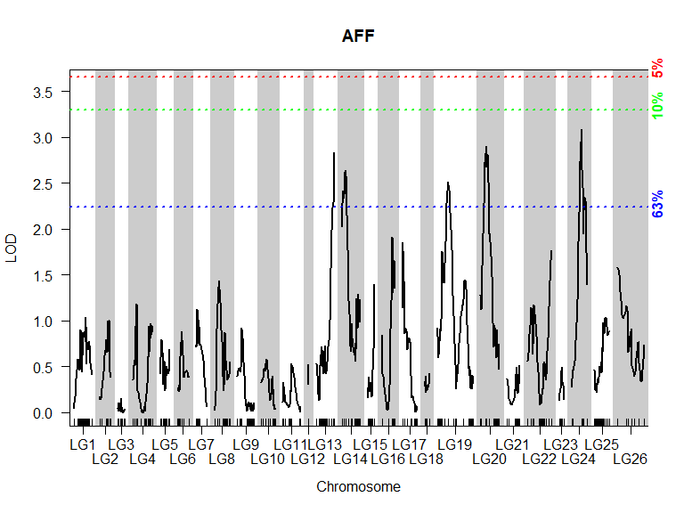
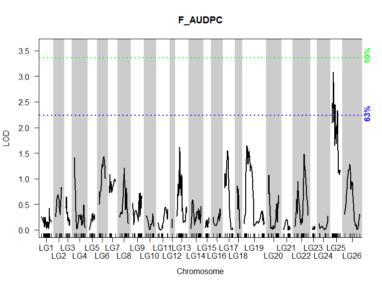

Genetic Mapping and QTL Analysis
================


Load packages

``` r
library(qtl)
library(ASMap)
library(dplyr)
library(corrplot)
```

    ## Warning: package 'corrplot' was built under R version 4.2.3

``` r
library(LinkageMapView)
```

Import genotypic data. for now, all markers are on 1 chr

``` r
data<-read.cross("csvr",".","raw_data.csv",genotypes=c("a","h","b"),map.function="kosambi")
```

    ##  --Read the following data:
    ##   152  individuals
    ##   791  markers
    ##   14  phenotypes

    ## Warning in summary.cross(cross): Some chromosomes > 1000 cM in length; there may be a problem with the genetic map.
    ##   (Perhaps it is in basepairs?)

    ##  --Cross type: f2

Convert cross to bcsft type f2 to use ASMap package

``` r
data<-convert2bcsft(data,F.gen=2,estimate.map=F)
cat("Phenos:")
```

    ## Phenos:

``` r
cbind(head(phenames(data),-1))
```

    ##       [,1]      
    ##  [1,] "AFF"     
    ##  [2,] "AFS"     
    ##  [3,] "AFL"     
    ##  [4,] "AG"      
    ##  [5,] "AYS"     
    ##  [6,] "AYL"     
    ##  [7,] "FOB1"    
    ##  [8,] "FOB2"    
    ##  [9,] "FOB3"    
    ## [10,] "F_AUDPC" 
    ## [11,] "Cold"    
    ## [12,] "FOB3_bin"
    ## [13,] "BDM"

``` r
n<-11 #normal phenotypes count
```

# Data Pre-processing

Look at the pattern of missing data. Black pixels indicate missing
genotypes.

``` r
plotMissing(data)
```

<!-- -->

Omit the individuals with more than 85% of total markers -\> less than
672 markers. Briefly estimate map first.

``` r
data<-quickEst(data,map.function="kosambi")
sg<-statGen(data,bychr=F,stat.type="miss",id='index')
data1<-subset(data,ind=om<-sg$miss<(totmar(data))*0.85)
cat(if(F%in%om) which(!om)else "no","ind omitted for missing > 85% mar")
```

    ## no ind omitted for missing > 85% mar

Plot the number of genotyped markers per individual as well as the
number of genotyped individuals per marker

``` r
par(mfrow=c(1,2), las=1)
plot(ntyped(data1), ylim=c(0,totmar(data1)+50),ylab="No. typed markers",main="Markers by Individual")
mtext("A",adj=0)
plot(ntyped(data1, "mar"), ylim=c(0,(nind(data1)+15)),ylab="No. typed individuals",main="Individuals by Marker")
mtext("B",adj=0)
```

<!-- -->

Plot the genotype frequencies per individual

``` r
g <- pull.geno(data1)
gfreq <- apply(g, 1, function(a) table(factor(a, levels=1:3)))
gfreq <- t(t(gfreq) / colSums(gfreq))
par(mfrow=c(1,3), las=1)
for(i in 1:3){
  plot(gfreq[i,], ylab="Genotype frequency",ylim=c(0,1))
  abline(h=mean(gfreq[i,]),lty=3,col="red",lwd=3)
  mtext(c("AA", "AB", "BB")[i])}
par(mfrow=c(1,1));title("Genotypes' Frequency and Segregation Ratio",line = 2.5)
```

<!-- -->

Compare the genotypes for all pairs of individuals

``` r
cg<-comparegeno(data1);cgr<-cg[lower.tri((cg))]
hist(cgr, breaks=seq(0, 1, len=101),xlab="No. matching genotypes", main="Matching Pairs of Individuals")
rug(cgr)
#mark the outlier with a red arrow 
x<-max(cgr)
arrow.plot(x,50,0,-1,true.angle = T,arrow.ex=30, length=.1,col='red', lwd=2)
text(x,70,paste0(round(100*x,1),"%"),adj=c(0.5,0.2))
```

<!-- -->

Omit individuals with more than 90% identical markers

``` r
wh<-which(cg>0.9,arr=T)
data2<-subset(data1,ind=-wh[,2])
cat(nind(data1)-nind(data2),"ind omitted for",paste0(round(100*x,1),"%"),"identical geno\n",paste0("#", data1$pheno$index[wh[,2]]))
```

    ## 2 ind omitted for 96.9% identical geno
    ##  #132 #134

Pull out markers from cross temporarily

``` r
cat(totmar(data2),'total mar\n')
```

    ## 791 total mar

``` r
data3<-pullCross(data2,type="missing",pars=list(miss.thresh=0.1))
cat(totmar(data3),'total mar\n')
```

    ## 760 total mar

``` r
cat(totmar(data2)-totmar(data3),"mar pulled for missing\n")
```

    ## 31 mar pulled for missing

``` r
data4<-pullCross(data3,type="seg.distortion",pars=list(seg.thresh=0.001))
cat(totmar(data4),'total mar\n')
```

    ## 726 total mar

``` r
cat(totmar(data3)-totmar(data4),"mar pulled for seg. distortion\n")
```

    ## 34 mar pulled for seg. distortion

``` r
data5<-pullCross(data4,type="co.located")
cat(totmar(data5),'total mar\n')
```

    ## 567 total mar

``` r
cat(totmar(data4)-totmar(data5),"mar pulled for co. located")
```

    ## 159 mar pulled for co. located

Plot optional p. values to determine distance threshold for marker
clustering. I chose pValue= 1e-7 (on y axis), meaning-\>\> split linkage
groups with more than 30cM gap between markers, according to 150 ind
population (on x axis)

``` r
cat(nind(data5),"individuals are used to cluster markers")
```

    ## 150 individuals are used to cluster markers

``` r
pValue(dist=seq(25,40,by=5),pop.size=110:190)
```

<!-- -->

LOD(Logarithm of the Odds)= statistical measure of the likelihood that
two loci (positions on a chromosome) are linked and therefore inherited
together, rather than assorting independently.

# Map Construction

Form linkage groups with LOD=7, raw map

``` r
data5<-mstmap(data5,bychr=F,p.value=1e-7,id='index')
```

    ## Number of linkage groups: 28
    ## The size of the linkage groups are: 39   32  47  33  27  12  19  10  38  18  28  19  27  8   11  40  11  13  24  17  16  20  17  1   21  1   16  2   
    ## The number of bins in each linkage group: 34 23  35  26  20  9   13  8   30  14  25  15  20  8   10  35  11  11  18  14  14  13  17  1   20  1   12  2   

``` r
plotMap(data5,alternate.chrid = T)
```

<!-- -->

Profile individuals’ genotype statistics

Omit missing/ double crossover (dxo)/ xo statistics outlier individuals

``` r
data6<-subsetCross(data5,ind=!pg$xo.lambda)
cat(nind(data5)-nind(data6),"ind omitted by profileGen")
```

    ## 1 ind omitted by profileGen

Double check dxo. An unusually high rate of double crossovers might
indicate genotyping errors

``` r
pg1<-profileGen(data6,bychr=F,stat.type=c("xo","dxo","miss"),id="index",xo.lambda=median(pg1$stat$xo),layout=c(1,3),lty=2,cex=0.7)
```

<!-- -->

Re-construct map. The genotyping errors can distort the distances
between markers, the order of the inputted markers is respected

``` r
data7<-mstmap(data6,bychr=F,anchor=T,p.value=1e-7,id='index')
```

    ## Number of linkage groups: 28
    ## The size of the linkage groups are: 39   18  28  19  27  8   11  40  11  13  24  32  17  16  20  17  1   21  1   16  2   47  33  27  12  19  10  38  
    ## The number of bins in each linkage group: 33 14  25  15  20  8   10  35  11  11  17  22  14  13  13  16  1   20  1   12  2   35  26  19  9   13  8   30  

Push back markers to the map

``` r
cat(totmar(data7),'total mar ')
```

    ## 567 total mar

``` r
data8<-pushCross(data7,type="co.located")
cat(totmar(data8),'total mar ')
```

    ## 726 total mar

``` r
cat(totmar(data8)-totmar(data7),"mar pushed for co. located")
```

    ## 159 mar pushed for co. located

Re-construct final map by adding markers to existing LGs (linkage
groups)

Drop LGs with less than 2 markers

``` r
mndrop<-markernames(data9,nmar(data9)<2)
data10<-drop.markers(data9,as.character(mndrop))
cat(totmar(data10),'total mar')
```

    ## 724 total mar

``` r
cat(totmar(data9)-totmar(data10),"mar omitted for LG < 2 mar")
```

    ## 2 mar omitted for LG < 2 mar

Rename chr by numerical order

``` r
x<-1:nchr(data10)
for (i in x) {names(data10$geno)[i]<-paste0("LG",i)}
```

Plot genetic map illustration, final map

``` r
plot.map(data10,alternate.chrid=T)
```

<!-- -->

LGs summary table

``` r
summaryMap(data10)
```

    ##         n.mar length ave.spacing max.spacing
    ## LG1        66   58.5         0.9        12.8
    ## LG2        13   34.4         2.9        14.6
    ## LG3        24   22.3         1.0         4.7
    ## LG4        33   64.0         2.0        11.5
    ## LG5        22   29.9         1.4         6.3
    ## LG6        23   36.1         1.6        15.2
    ## LG7        20   33.8         1.8        21.9
    ## LG8        26   48.9         2.0        11.2
    ## LG9        29   52.6         1.9        17.0
    ## LG10       18   43.9         2.6         8.9
    ## LG11       16   56.6         3.8        25.6
    ## LG12        2    1.9         1.9         1.9
    ## LG13       67   56.7         0.9         9.9
    ## LG14       34   58.7         1.8        10.8
    ## LG15       47   20.8         0.5         4.5
    ## LG16       12   41.1         3.7        18.5
    ## LG17       19   46.6         2.6        10.4
    ## LG18       10   15.7         1.7         8.5
    ## LG19       53  114.3         2.2        23.2
    ## LG20       44   60.7         1.4        14.4
    ## LG21       19   40.9         2.3        19.6
    ## LG22       27   77.1         3.0        14.7
    ## LG23        8   14.9         2.1         4.1
    ## LG24       11   49.3         4.9        26.9
    ## LG25       70   47.8         0.7         6.5
    ## LG26       11   86.3         8.6        28.8
    ## overall   724 1213.7         1.7        28.8

# Map Evaluation

Estimate recombination fraction

``` r
data10<-est.rf(data10)
```

Heatmap of LOD and Rf

``` r
heatMap(data10,lmax = 70,main='')
mtext("Pairwise Recombination Fractions and LOD Scores",cex=1.1,line=3.2,adj=0.4,font=2)
```

<!-- -->

Plot Pairwise LOD vs. Rf

``` r
rf<-pull.rf(data10);lod<-pull.rf(data10,what="lod")
plot(as.numeric(rf),as.numeric(lod),xlab="Recombination fraction",ylab="LOD score",main=paste("Pairwise LOD vs. Rf for",totmar(data10),"Markers"))
```

<!-- -->

The evaluation looks good:

The heatmap is continuous with low gradient along the chr meaning that
the markers within a chromosome are gradually distant from each other.

On the LOD/rf scatter plot there is a trend line with no outliers.

# Exploratory Data Analysis

Jitter map- to avoid marker overlaping by slightly adding gaps between
them

``` r
data<-jittermap(data10)
```

Create a df of parents phenotype

``` r
cold_values <- c(5, 5, 4, 6, 7, 9, 5, 6, 6, 7, NA, NA, 7, 8, 7, 8, 8, 8, 9, 9, 9, 8, NA, NA)
faudpc_values <- c(rep(0, 12), rep(c(90, 142), each = 6))
parents <- data.frame(rbind(matrix(0,12,9), matrix(5,12,9)),faudpc_values, Cold = cold_values,row.names = c(paste0("P1_", 1:12), paste0("DP_", 1:12)))
ant_values <-c(5, 4.5, 4.5, 4.5, 4.5, 3.5, 4, 4.5, 4, 4.5, 4, 4)
parents[13:24,1:3] <-matrix(ant_values,12,3)
colnames(parents) <-phenames(data)[1:11]
head(parents)
```

    ##      AFF AFS AFL AG AYS AYL FOB1 FOB2 FOB3 F_AUDPC Cold
    ## P1_1   0   0   0  0   0   0    0    0    0       0    5
    ## P1_2   0   0   0  0   0   0    0    0    0       0    5
    ## P1_3   0   0   0  0   0   0    0    0    0       0    4
    ## P1_4   0   0   0  0   0   0    0    0    0       0    6
    ## P1_5   0   0   0  0   0   0    0    0    0       0    7
    ## P1_6   0   0   0  0   0   0    0    0    0       0    9

Check the phenotypic distribution

Plot histograms or barplots

``` r
cbind(phenames(data)) 
```

    ##       [,1]      
    ##  [1,] "AFF"     
    ##  [2,] "AFS"     
    ##  [3,] "AFL"     
    ##  [4,] "AG"      
    ##  [5,] "AYS"     
    ##  [6,] "AYL"     
    ##  [7,] "FOB1"    
    ##  [8,] "FOB2"    
    ##  [9,] "FOB3"    
    ## [10,] "F_AUDPC" 
    ## [11,] "Cold"    
    ## [12,] "FOB3_bin"
    ## [13,] "BDM"     
    ## [14,] "index"

<!-- --><!-- --><!-- -->

Plot the correlation matrices using corrplot

``` r
mat<-cor(pull.pheno(data,c(1:10,12,13,11)),use = "complete.obs")
corrplot(mat,type = 'upper',method = "color", addCoef.col = "orange", tl.col = "black", tl.srt = 35,tl.cex=0.7,number.cex=0.5) 
```

<!-- -->

Now, for each group of phenotypes

Fusarium

``` r
mat<-cor(pull.pheno(data,c(7:10,12)),use = "complete.obs")
corrplot(mat, type='upper',method = "color", addCoef.col = "white", tl.col = "black", tl.srt = 35)
```

<!-- -->

Anthocyanin

``` r
mat<-cor(pull.pheno(data,1:6),use = "complete.obs")
corrplot(mat, type='upper',method = "color", addCoef.col = "white", tl.col = "black", tl.srt = 35)
```

<!-- -->

There is a strong correlation between the phenotypes in the same group.
the different conditions (in anthocyanin) or repetitions (in fusarium)
had a limited effect on the resulting phenotype.

# QTL Analysis

Perform genome scans to identify QTL

``` r
if (all(file.exists("genome_scans.Rdata","scan2_part1.Rdata","scan2_lod_part2.Rdata"))) {
  message("Loading precomputed genome scans from genome_scans.Rdata, scan2_part1.Rdata and scan2_lod_part2.Rdata to save time.")
  load("genome_scans.Rdata")
  # Load the parts (scan2 is a large file so I split it into 2 parts)
  load("scan2_part1.Rdata")
  load("scan2_lod_part2.Rdata")
  lod_part1<-scan2.partial$lod
  # Combine the 'lod' matrix parts back into a single matrix
  combined_lod <- array(NA, dim = c(dim(lod_part1)[1] + dim(lod_part2)[1], dim(lod_part1)[2], dim(lod_part1)[3]))
  # Copy the data from the parts into the combined array
  combined_lod[1:dim(lod_part1)[1], , ] <- lod_part1
  combined_lod[(dim(lod_part1)[1] + 1):dim(combined_lod)[1], , ] <- lod_part2
  # Set the dimnames attribute correctly
  dimnames(combined_lod) <- dimnames(scan2.partial$lod)
  # Reconstruct the scantwo object
  scan2 <- scan2.partial  # Copy the original object structure
  scan2$lod <- combined_lod  # Replace the 'lod' part with the combined matrix
  # cleanup
  rm(list=c("scan2.partial","combined_lod","lod_part1","lod_part2"))
} else {
  cat("The precomputed genome scans were not found\n")
  message("Performing genome scans... This may take a long time.")
  
  ###ScanOne###
  #calculate probabilities (necessary for scanone)
  #normal #Haley-knott regression 
  data<-calc.genoprob(data,2,map.function="kosambi")
  #genome scan for Single-QTL
  scan1<-scanone(data,pheno.col=c(1:n),method="hk")
  #permutation test
  operm <- vector("list", 100)
  for(i in 1:100){operm[[i]]<-scanone(data,pheno.col=c(1:n),method="hk",n.perm=9,n.cluster=2)}
  scan1perm<-do.call("rbind", operm)
  
  #binary #EM algorithm maximum likelihood
  data<-calc.genoprob(data,3,map.function="kosambi")
  #genome scan for Single-QTL
  scan1.bin<-scanone(data,pheno.col=c(12:13),method="em",model="binary")
  #permutation test
  scan1perm.bin1<-scanone(data,pheno.col=c(12:13),method="em",model="binary",n.perm=1000,n.cluster=2)
  operm <- vector("list", 100)
  for(i in 1:100){operm[[i]]<-scanone(data,pheno.col=c(12:13),method="em",model="binary",n.perm=10,n.cluster=2)}
   scan1perm.bin1<-do.call("rbind", operm)
   
   save(scan1,scan1.bin,scan1perm,scan1perm.bin,scan2.bin,scan2perm,scan2perm.bin,file="genome_scans.Rdata")
   
   ###ScanTwo###
   #normal #scan genome for Two-QTL model
   data<-clean(data)
   data<-calc.genoprob(data,2,map.function="kosambi")
   scan2<-scantwo(data,pheno.col=c(1:n),method="hk")
   #permutation test
   ##this proccess is heavy so I split it into 4 parts and then merged the results. with better CPU performance U can run the following line instead:
   ##scan2perm.bin<-scantwo(data,pheno.col=c(1:n),method="hk",n.perm=1000)
   #res1
   operm2 <- vector("list", 100)
   for(i in 1:100 ){operm2[[i]]<-scantwo(data,pheno.col=c(1:6),method="hk",n.perm=9,n.cluster=2)}
   res1<-do.call("rbind", operm2)
   #res2
   operm2 <-vector("list", 100)
   for(i in 1:100 ){operm2[[i]]<-scantwo(data,pheno.col=c(7:8),method="hk",n.perm=9,n.cluster=2)}
   res2<-do.call("rbind", operm2)
   #res3
   operm2 <- vector("list", 100)
   for(i in 1:100 ){operm2[[i]]<-scantwo(data,pheno.col=c(9:10),method="hk",n.perm=9,n.cluster=2)}
   res3<-do.call("rbind", operm2)
   #res4
   operm2 <- vector("list", 100)
   for(i in 1:100 ){operm2[[i]]<-scantwo(data,pheno.col=11,method="hk",n.perm=9,n.cluster=2)}
   res4<-do.call("rbind", operm2)
   #cbind the 11 phenos 
   scan2perm<-res1
   for(i in 1:6){scan2perm[[i]]<-cbind(res1[[i]],res2[[i]],res3[[i]],res4[[i]])}
   
   #binary #genome scan for two-QTL
   data<-calc.genoprob(data,10,map.function="kosambi")
   scan2.bin<-scantwo(data,pheno.col=c(12,13),method="em",model="binary",verbose=T)
   #permutation test
   ##this proccess is heavy so I split it into 4 parts and then merged the results. with better CPU performance U can run the following line instead:
  ##scan2perm.bin<-scantwo(data,pheno.col=c(12:13),method="em",model="binary",n.perm=1000)
  operm2 <- vector("list", 200)
  for(i in 1:100 ){operm2[[i]]<-scantwo(data,pheno.col=c(12:13),method="em",model="binary",n.perm=5,n.cluster=2)}
   for(i in 101:200 ){operm2[[i]]<-scantwo(data,pheno.col=c(12:13),method="em", model="binary",n.perm=5,n.cluster=2)}
   scan2perm.bin<-do.call("rbind", operm2[1:200])
}
```

    ## Loading precomputed genome scans from genome_scans.Rdata, scan2_part1.Rdata and scan2_lod_part2.Rdata to save time.

Setting a QTL detection threshold according to permutation tests. The
lower the precentage (5%), the better significance of the QTL.

``` r
(thresh1.hk<-summary(scan1perm,alpha=c(0.63,0.1,0.05))) 
```

    ## LOD thresholds (1000 permutations)
    ##      AFF  AFS  AFL   AG  AYS  AYL FOB1 FOB2 FOB3 F_AUDPC Cold
    ## 63% 2.25 2.23 2.25 2.24 2.26 2.24 2.24 2.24 2.24    2.24 2.22
    ## 10% 3.31 3.32 3.32 3.36 3.45 3.33 3.32 3.37 3.38    3.35 3.26
    ## 5%  3.74 3.68 3.69 3.71 3.77 3.80 3.70 3.77 3.70    3.76 3.62

``` r
(thresh2.em<-summary(scan1perm.bin,alpha=c(0.63,0.1,0.05)))
```

    ## LOD thresholds (1000 permutations)
    ##     FOB3_bin  BDM
    ## 63%     2.23 2.25
    ## 10%     3.26 3.26
    ## 5%      3.71 3.62

Scan for additional QTL after reducing the masking effect of QTL with
major peaks.

Threshold colors

``` r
thcol<-c('blue','green','red')
```

Plot LOD curves per phenotype, QTL peaks

``` r
for(i in 1:(length(phenames(data))-3)){
  p<-phenames(data)[i]
  plot(scan1,lodcolumn=i,main=p,ylab="LOD",bandcol="gray80",ylim=c(0,max(scan1[,2+i])+0.5),alternate.chrid = T)
    abline(h=thresh1.hk[,i],lty='dotted',lwd=2,col=thcol)
    for(j in 1:3){
      if(thresh1.hk[j,i]/par('usr')[4]<1){
        mtext(rownames(thresh1.hk)[j],side=4,font=2,adj=thresh1.hk[j,i]/(par('usr')[4]-0.2),col=thcol[j])
      }
    }
}
```

<!-- --><!-- --><!-- --><!-- --><!-- --><!-- --><!-- --><!-- --><!-- --><!-- --><!-- -->

``` r
for(i in 1:2){
  p<-phenames(data)[i+n]
  plot(scan1.bin,lodcolumn=i,main=p,ylab="LOD",bandcol="gray80",ylim=c(0,max(scan1.bin[,2+i])+0.5),alternate.chrid = T)
    abline(h=thresh2.em[,i],lty='dotted',lwd=2,col=thcol)
    for(j in 1:3){
      if(thresh2.em[j,i]/par('usr')[4]<1){
        mtext(rownames(thresh2.em)[j],side=4,font=2,adj=thresh2.em[j,i]/(par('usr')[4]-0.2),col=thcol[j])
      }
    }
}
```

<!-- --><!-- -->

``` r
options(warn=0)
#normal
qtlist<-summary(scan1,perms=scan1perm,format="tabByCol",alpha=0.95,ci.function="bayesint",pvalues=T)
  data<-calc.genoprob(data,2,map.function="kosambi")
  qtlist.aq<-list()
  s.aq<-list()
  for (i in 1:n){
    p<-phenames(data)[i]
    if(!is.null(out.aq[[p]])){
      s<-summary(out.aq[[p]],format="tabByCol",perms=scan1perm[,p],alpha=0.95,ci.function="bayesint",pvalues=T)
      if(nrow(s[[1]])>0){
        qtlist.aq[p]<-s
        qtlist.aq[[p]]<-cbind.data.frame(Trait=p,qtlist.aq[[p]])
        s.aq[[p]]<-summary(out.aq[[p]],perms=scan1perm[,p],alpha=0.63)
        if(nrow(s.aq[[p]])>0){
          rqtl[[p]]<-addtoqtl(data,rqtl[[p]],s.aq[[p]][,1],s.aq[[p]][,2])
        }
      }
    }
  }
  for (i in 1:length(qtlist)){
    if(colnames(qtlist[[i]])[1]!="Trait"){
      qtlist[[i]]<-cbind.data.frame(Trait=names(qtlist[i]),qtlist[[i]])
    }
  }
  qtldf<-do.call(rbind.data.frame,c(qtlist,make.row.names=F))
  
  for (i in 1:n){
    if(names(qtlist[i])%in%names(qtlist.aq)){
      qtlist[[i]]<-rbind(qtlist[[i]],qtlist.aq[[phenames(data)[i]]])
    }
  }
  qtldf.aq<-do.call(rbind.data.frame,c(qtlist,make.row.names=F))
  
  #binary
  qtlist<-summary(scan1.bin,perms=scan1perm.bin,format="tabByCol",alpha=0.95,ci.function="bayesint",pvalues=T)
  data<-calc.genoprob(data,3,map.function="kosambi")
  for (i in 1:2){
    p<-phenames(data)[i+n]
    if(!is.null(out.aq.bin[[p]])){
      s<-summary(out.aq.bin[[p]],perms=scan1perm.bin[,p],alpha=0.95,format="tabByCol",ci.function="bayesint",pvalues=T)
      if(nrow(s[[1]])>0){
        qtlist.aq[p]<-s
        qtlist.aq[[p]]<-cbind.data.frame(Trait=p,qtlist.aq[[p]])
        s.aq[[p]]<-summary(out.aq.bin[[p]],perms=scan1perm.bin[,p],alpha=0.63)
        if(nrow(s.aq[[p]])>0){
          rqtl.bin[[p]]<-addtoqtl(data,rqtl.bin[[p]],s.aq[[p]][,1],s.aq[[p]][,2])
        }
      }
    }
  }
  for (i in 1:length(qtlist)){
    qtlist[[i]]<-cbind.data.frame(Trait=names(qtlist[i]),qtlist[[i]])
  }
  for (i in 1:length(qtlist)){
    qtldf<-rbind.data.frame(qtldf,qtlist[[i]],make.row.names=F)
  }
  for (i in 1:2){
    if(names(qtlist[i])%in%names(qtlist.aq)){
      qtlist[[i]]<-rbind(qtlist[[i]],qtlist.aq[[phenames(data)[i+n]]])
    }
  }
  qtldf.aq.bin<-do.call(rbind.data.frame,c(qtlist,make.row.names=F))
  qtldf.aq<-rbind(qtldf.aq,qtldf.aq.bin)
```

QTL summary as dataframe for final report. QTL at alp= 0.99 and sig
\*\*\* levels

``` r
su<-1-summary(data)$missing.phe
qtldf.aq<-qtldf.aq%>%
  mutate("Len of LG"=round(chrlen(data)[chr],1),.after=chr)%>%
  mutate("Len of QTL"=round(ci.high-ci.low,1),.after="Len of LG")%>%
  mutate("Flanking markers"=paste0(chr,"_m",find.marker(data,chr,ci.low),"-",chr,"_m",find.marker(data,chr,ci.high)))%>%
  mutate("Central marker"=paste0(chr,"_m",find.marker(data,chr,pos)))%>%
  mutate("Pval"=paste0(pval,if_else(pval<0.63,"*",""),if_else(pval<0.1,"*",""), if_else(pval<0.05,"*","")))%>%
  select(!c(pval,ci.low,ci.high))%>%
  rename("QTL's LG"=chr)%>%
  mutate("No. Inds/% phenotyped"=paste0(nind(data)*su[find.pheno(data,Trait)]," ind / ",round(100*su[find.pheno(data,Trait)],1),"%"),.after=Trait)%>%
  mutate("pos"=round(pos,1))%>%
  mutate("lod"=round(lod,1))
qtldf.aq
```

    ##       Trait No. Inds/% phenotyped QTL's LG Len of LG Len of QTL   pos lod
    ## 1       AFF        149 ind / 100%      LG6      36.1       29.0  56.1 2.8
    ## 2       AFF        149 ind / 100%      LG7      33.8       57.2  48.0 2.6
    ## 3       AFF        149 ind / 100%      LG9      52.6       41.1   8.2 1.9
    ## 4       AFF        149 ind / 100%     LG10      43.9       32.6  45.5 1.8
    ## 5       AFF        149 ind / 100%     LG13      56.7       82.0  81.3 2.5
    ## 6       AFF        149 ind / 100%     LG14      58.7       24.0  42.0 2.9
    ## 7       AFF        149 ind / 100%     LG16      41.1       77.1   0.0 1.8
    ## 8       AFF        149 ind / 100%     LG18      15.7       22.0  17.6 3.1
    ## 9       AFF        149 ind / 100%     LG14      58.7       58.7  56.0 1.9
    ## 10      AFS        149 ind / 100%      LG6      36.1       44.9  56.5 2.3
    ## 11      AFS        149 ind / 100%      LG7      33.8       51.6  48.0 2.7
    ## 12      AFS        149 ind / 100%     LG10      43.9       28.6  45.5 2.1
    ## 13      AFS        149 ind / 100%     LG13      56.7       81.9  81.3 2.5
    ## 14      AFS        149 ind / 100%     LG14      58.7       26.0  38.0 3.1
    ## 15      AFS        149 ind / 100%     LG16      41.1       77.1   0.0 1.7
    ## 16      AFS        149 ind / 100%     LG18      15.7       22.0  17.6 3.3
    ## 17      AFS        149 ind / 100%     LG20      60.7       86.3  86.0 2.0
    ## 18      AFS        149 ind / 100%     LG14      58.7       58.7  56.0 2.1
    ## 19      AFL        149 ind / 100%      LG6      36.1       16.5  56.1 2.8
    ## 20      AFL        149 ind / 100%      LG7      33.8       18.6  56.0 2.8
    ## 21      AFL        149 ind / 100%      LG9      52.6       14.0   8.2 2.3
    ## 22      AFL        149 ind / 100%     LG10      43.9       45.1  45.5 1.9
    ## 23      AFL        149 ind / 100%     LG13      56.7       80.2  80.0 2.5
    ## 24      AFL        149 ind / 100%     LG14      58.7       26.0  38.0 2.7
    ## 25      AFL        149 ind / 100%     LG18      15.7       24.0  17.6 2.8
    ## 26       AG        149 ind / 100%      LG6      36.1       41.5  56.1 2.3
    ## 27       AG        149 ind / 100%      LG7      33.8       57.2  56.0 2.0
    ## 28       AG        149 ind / 100%      LG9      52.6       41.1   8.0 2.2
    ## 29       AG        149 ind / 100%     LG11      56.6       20.0   3.0 2.0
    ## 30       AG        149 ind / 100%     LG13      56.7       49.4  99.5 2.5
    ## 31       AG        149 ind / 100%     LG14      58.7       26.0  36.0 2.5
    ## 32       AG        149 ind / 100%      LG6      36.1       26.0   8.0 2.0
    ## 33      AYS        149 ind / 100%      LG6      36.1       44.9  56.1 2.1
    ## 34      AYS        149 ind / 100%      LG9      52.6       41.1   8.0 1.9
    ## 35      AYS        149 ind / 100%     LG13      56.7       79.0  76.0 2.4
    ## 36      AYL        149 ind / 100%      LG6      36.1       56.5  56.1 1.8
    ## 37      AYL        149 ind / 100%      LG7      33.8       57.2  45.8 2.1
    ## 38      AYL        149 ind / 100%      LG9      52.6       41.1   6.5 1.9
    ## 39      AYL        149 ind / 100%     LG13      56.7       89.4  76.0 2.3
    ## 40     FOB1       117 ind / 78.5%     LG19     114.3       33.8  41.1 1.9
    ## 41     FOB1       117 ind / 78.5%     LG22      77.1       31.1  62.0 2.1
    ## 42     FOB2       118 ind / 79.2%     LG13      56.7       94.3  99.5 1.9
    ## 43     FOB2       118 ind / 79.2%     LG19     114.3       39.8  40.0 2.7
    ## 44     FOB2       118 ind / 79.2%     LG19     114.3       85.7  28.0 2.2
    ## 45     FOB3       118 ind / 79.2%      LG6      36.1       40.0  17.7 2.0
    ## 46     FOB3       118 ind / 79.2%     LG10      43.9       21.5  30.4 2.6
    ## 47     FOB3       118 ind / 79.2%     LG16      41.1       64.0  22.0 1.7
    ## 48     FOB3       118 ind / 79.2%     LG19     114.3       31.8  40.0 3.7
    ## 49     FOB3       118 ind / 79.2%     LG24      49.3       24.0  12.0 2.4
    ## 50  F_AUDPC       118 ind / 79.2%     LG13      56.7      110.3 100.0 1.7
    ## 51  F_AUDPC       118 ind / 79.2%     LG19     114.3       31.8  40.0 3.2
    ## 52  F_AUDPC       118 ind / 79.2%     LG19     114.3       94.5  26.0 2.0
    ## 53     Cold        149 ind / 100%     LG15      20.8       27.2  16.0 2.0
    ## 54 FOB3_bin       118 ind / 79.2%      LG6      36.1       56.5  17.7 2.1
    ## 55 FOB3_bin       118 ind / 79.2%     LG10      43.9       26.7  30.4 1.9
    ## 56 FOB3_bin       118 ind / 79.2%     LG14      58.7       60.7  57.8 1.9
    ## 57 FOB3_bin       118 ind / 79.2%     LG16      41.1       55.3  21.0 1.8
    ## 58 FOB3_bin       118 ind / 79.2%     LG19     114.3       17.1  39.9 4.6
    ## 59 FOB3_bin       118 ind / 79.2%     LG24      49.3       21.0   9.0 2.5
    ## 60      BDM        149 ind / 100%      LG6      36.1       42.0  12.4 1.8
    ## 61      BDM        149 ind / 100%     LG13      56.7      109.4 107.1 2.7
    ## 62      BDM        149 ind / 100%     LG19     114.3       23.5  42.2 2.1
    ## 63      BDM        149 ind / 100%     LG24      49.3       26.0   9.0 3.2
    ##             Flanking markers Central marker     Pval
    ## 1      LG6_m51714-LG6_m34544     LG6_m34544   0.239*
    ## 2    LG7_m170952-LG7_m217861    LG7_m217861   0.342*
    ## 3    LG9_m148870-LG9_m233623    LG9_m207796    0.849
    ## 4  LG10_m126321-LG10_m254187   LG10_m254187    0.877
    ## 5  LG13_m256334-LG13_m152483   LG13_m152483   0.443*
    ## 6  LG14_m180209-LG14_m226669   LG14_m120084   0.219*
    ## 7     LG16_m98366-LG16_m1644    LG16_m98366    0.904
    ## 8   LG18_m119483-LG18_m50269    LG18_m50269   0.154*
    ## 9    LG14_m187879-LG14_m2633    LG14_m83713    0.863
    ## 10    LG6_m249118-LG6_m34544     LG6_m34544   0.601*
    ## 11   LG7_m213456-LG7_m217861    LG7_m217861   0.326*
    ## 12 LG10_m153546-LG10_m254187   LG10_m254187    0.747
    ## 13 LG13_m208332-LG13_m152483   LG13_m152483   0.441*
    ## 14 LG14_m180209-LG14_m226669   LG14_m120084    0.16*
    ## 15    LG16_m98366-LG16_m1644    LG16_m98366    0.939
    ## 16  LG18_m119483-LG18_m50269    LG18_m50269   0.103*
    ## 17 LG20_m213579-LG20_m112128   LG20_m112128    0.812
    ## 18   LG14_m187879-LG14_m2633    LG14_m83713    0.729
    ## 19     LG6_m34544-LG6_m34544     LG6_m34544   0.261*
    ## 20   LG7_m217861-LG7_m217861    LG7_m217861   0.269*
    ## 21    LG9_m148870-LG9_m74935    LG9_m207796   0.586*
    ## 22 LG10_m128007-LG10_m254187   LG10_m254187    0.873
    ## 23    LG13_m727-LG13_m152483   LG13_m152483    0.44*
    ## 24 LG14_m180209-LG14_m226669   LG14_m120084   0.289*
    ## 25  LG18_m203249-LG18_m50269    LG18_m50269   0.261*
    ## 26    LG6_m219262-LG6_m34544     LG6_m34544   0.604*
    ## 27   LG7_m170952-LG7_m217861    LG7_m217861    0.841
    ## 28   LG9_m148870-LG9_m233623    LG9_m207796    0.667
    ## 29 LG11_m170544-LG11_m203219    LG11_m82354    0.791
    ## 30 LG13_m152483-LG13_m152483   LG13_m152483   0.445*
    ## 31  LG14_m180209-LG14_m81839   LG14_m105316   0.463*
    ## 32    LG6_m104199-LG6_m51714    LG6_m118896    0.827
    ## 33    LG6_m249118-LG6_m34544     LG6_m34544    0.753
    ## 34   LG9_m148870-LG9_m233623    LG9_m207796    0.845
    ## 35    LG13_m727-LG13_m152483   LG13_m152483   0.537*
    ## 36    LG6_m104199-LG6_m34544     LG6_m34544    0.918
    ## 37   LG7_m170952-LG7_m217861    LG7_m217861    0.701
    ## 38   LG9_m148870-LG9_m233623    LG9_m207796    0.847
    ## 39    LG13_m727-LG13_m152483   LG13_m152483   0.551*
    ## 40  LG19_m62803-LG19_m176482   LG19_m164757    0.867
    ## 41 LG22_m155729-LG22_m213924   LG22_m159568    0.714
    ## 42  LG13_m84559-LG13_m152483   LG13_m152483    0.856
    ## 43 LG19_m234493-LG19_m176482   LG19_m164757   0.324*
    ## 44    LG19_m62803-LG19_m3026   LG19_m163917    0.657
    ## 45    LG6_m104199-LG6_m34544    LG6_m219262    0.821
    ## 46 LG10_m153546-LG10_m254187   LG10_m160161   0.389*
    ## 47   LG16_m102007-LG16_m1644   LG16_m256633    0.925
    ## 48  LG19_m62803-LG19_m176482   LG19_m164757 0.049***
    ## 49 LG24_m112367-LG24_m115022   LG24_m117386   0.546*
    ## 50 LG13_m131941-LG13_m152483   LG13_m152483    0.935
    ## 51  LG19_m62803-LG19_m176482   LG19_m164757   0.143*
    ## 52  LG19_m62803-LG19_m239080   LG19_m163917    0.791
    ## 53  LG15_m214988-LG15_m85151     LG15_m1307    0.804
    ## 54    LG6_m104199-LG6_m34544    LG6_m219262    0.732
    ## 55 LG10_m153546-LG10_m254187   LG10_m160161     0.88
    ## 56   LG14_m187879-LG14_m2633     LG14_m3973    0.865
    ## 57   LG16_m102007-LG16_m1644   LG16_m256633    0.923
    ## 58 LG19_m164757-LG19_m176482   LG19_m164757 0.014***
    ## 59 LG24_m112367-LG24_m115022   LG24_m117386   0.433*
    ## 60    LG6_m104199-LG6_m34544    LG6_m102306    0.927
    ## 61  LG13_m22723-LG13_m152483   LG13_m152483   0.316*
    ## 62 LG19_m163917-LG19_m176482   LG19_m164757    0.741
    ## 63 LG24_m112367-LG24_m115022   LG24_m117386    0.13*

QTL pairs summary

``` r
#normal
c.thr1<-list()
for(i in 1:n){
  (thr1<-summary(scan2, perms=scan2perm, alpha=0.2,lodcolumn=i,pvalues=T))
  if(i==1){c.thr1[[phenames(data)[i]]]<-thr1
  }else c.thr1[[phenames(data)[i]]]<-thr1
}
for (i in 1:length(c.thr1)){
  if(nrow(c.thr1[[i]])>0&&colnames(c.thr1[[i]])[1]!="Trait"){
    c.thr1[[i]]<-cbind.data.frame(Trait=names(c.thr1[i]),c.thr1[[i]])
  }
}
thr1df<-do.call(rbind.data.frame,c(c.thr1,make.row.names=F))
#binary
c.thr2<-list()
for(i in 1:2){
  (thr2<-summary(scan2.bin, perms=scan2perm.bin, alpha=0.2,lodcolumn=i,pvalues=T))
  if(i==1){c.thr2[[phenames(data)[i+n]]]<-thr2
  }else c.thr2[[phenames(data)[i+n]]]<-thr2
}
for (i in 1:length(c.thr2)){
  if(nrow(c.thr2[[i]])>0&&colnames(c.thr2[[i]])[1]!="Trait"){
    c.thr2[[i]]<-cbind.data.frame(Trait=names(c.thr2[i]),c.thr2[[i]])
  }
}
thr2df<-do.call(rbind.data.frame,c(c.thr2,make.row.names=F))
thr<-rbind(thr1df,thr2df)
```

QTL pairs

``` r
#normal
data<-calc.genoprob(data,2,map.function="kosambi")
qtlist<-summary(scan1,perms=scan1perm,format="tabByCol",alpha=0.63,ci.function="bayesint")
sc2thr1<-summary(scan2perm,alpha=0.2)
#rearrange the threshold list
th<-vector('list',5)
for(j in 1:5){th[[j]]<-t(sc2thr1[[j]])}
m<-do.call('cbind',th)
dimnames(m)<-list(phenames(data)[1:n],names(sc2thr1)[1:5])
out.ap<-list();qtlpairs<-list();s.fq<-list();out.fq<-list()
for(i in 1:n){
  p<-phenames(data)[i]
  if(length(qtlist[[p]][,1])>0){
    out.ap[[p]]<-addpair(data,qtlist[[p]][,1],p,rqtl[[p]],method="hk",verbose=T)
    qtlpairs[[p]]<-summary(out.ap[[p]],thresholds=m[p,])
    s.fq[[p]]<-summary(out.fq[[p]]<- fitqtl(data,p,rqtl[[p]],method="hk",get.ests=T))
  }
}
```

    ## Scanning full model for chr LG6 and LG6 
    ## Scanning add've model for chr LG6 and LG6 
    ## Scanning full model for chr LG6 and LG7 
    ## Scanning add've model for chr LG6 and LG7 
    ## Scanning full model for chr LG6 and LG13 
    ## Scanning add've model for chr LG6 and LG13 
    ## Scanning full model for chr LG6 and LG14 
    ## Scanning add've model for chr LG6 and LG14 
    ## Scanning full model for chr LG6 and LG18 
    ## Scanning add've model for chr LG6 and LG18 
    ## Scanning full model for chr LG7 and LG7 
    ## Scanning add've model for chr LG7 and LG7 
    ## Scanning full model for chr LG7 and LG13 
    ## Scanning add've model for chr LG7 and LG13 
    ## Scanning full model for chr LG7 and LG14 
    ## Scanning add've model for chr LG7 and LG14 
    ## Scanning full model for chr LG7 and LG18 
    ## Scanning add've model for chr LG7 and LG18 
    ## Scanning full model for chr LG13 and LG13 
    ## Scanning add've model for chr LG13 and LG13 
    ## Scanning full model for chr LG13 and LG14 
    ## Scanning add've model for chr LG13 and LG14 
    ## Scanning full model for chr LG13 and LG18 
    ## Scanning add've model for chr LG13 and LG18 
    ## Scanning full model for chr LG14 and LG14 
    ## Scanning add've model for chr LG14 and LG14 
    ## Scanning full model for chr LG14 and LG18 
    ## Scanning add've model for chr LG14 and LG18 
    ## Scanning full model for chr LG18 and LG18 
    ## Scanning add've model for chr LG18 and LG18 
    ## Scanning full model for chr LG6 and LG6 
    ## Scanning add've model for chr LG6 and LG6 
    ## Scanning full model for chr LG6 and LG7 
    ## Scanning add've model for chr LG6 and LG7 
    ## Scanning full model for chr LG6 and LG13 
    ## Scanning add've model for chr LG6 and LG13 
    ## Scanning full model for chr LG6 and LG14 
    ## Scanning add've model for chr LG6 and LG14 
    ## Scanning full model for chr LG6 and LG18 
    ## Scanning add've model for chr LG6 and LG18 
    ## Scanning full model for chr LG7 and LG7 
    ## Scanning add've model for chr LG7 and LG7 
    ## Scanning full model for chr LG7 and LG13 
    ## Scanning add've model for chr LG7 and LG13 
    ## Scanning full model for chr LG7 and LG14 
    ## Scanning add've model for chr LG7 and LG14 
    ## Scanning full model for chr LG7 and LG18 
    ## Scanning add've model for chr LG7 and LG18 
    ## Scanning full model for chr LG13 and LG13 
    ## Scanning add've model for chr LG13 and LG13 
    ## Scanning full model for chr LG13 and LG14 
    ## Scanning add've model for chr LG13 and LG14 
    ## Scanning full model for chr LG13 and LG18 
    ## Scanning add've model for chr LG13 and LG18 
    ## Scanning full model for chr LG14 and LG14 
    ## Scanning add've model for chr LG14 and LG14 
    ## Scanning full model for chr LG14 and LG18 
    ## Scanning add've model for chr LG14 and LG18 
    ## Scanning full model for chr LG18 and LG18 
    ## Scanning add've model for chr LG18 and LG18 
    ## Scanning full model for chr LG6 and LG6 
    ## Scanning add've model for chr LG6 and LG6 
    ## Scanning full model for chr LG6 and LG7 
    ## Scanning add've model for chr LG6 and LG7 
    ## Scanning full model for chr LG6 and LG9 
    ## Scanning add've model for chr LG6 and LG9 
    ## Scanning full model for chr LG6 and LG13 
    ## Scanning add've model for chr LG6 and LG13 
    ## Scanning full model for chr LG6 and LG14 
    ## Scanning add've model for chr LG6 and LG14 
    ## Scanning full model for chr LG6 and LG18 
    ## Scanning add've model for chr LG6 and LG18 
    ## Scanning full model for chr LG7 and LG7 
    ## Scanning add've model for chr LG7 and LG7 
    ## Scanning full model for chr LG7 and LG9 
    ## Scanning add've model for chr LG7 and LG9 
    ## Scanning full model for chr LG7 and LG13 
    ## Scanning add've model for chr LG7 and LG13 
    ## Scanning full model for chr LG7 and LG14 
    ## Scanning add've model for chr LG7 and LG14 
    ## Scanning full model for chr LG7 and LG18 
    ## Scanning add've model for chr LG7 and LG18 
    ## Scanning full model for chr LG9 and LG9 
    ## Scanning add've model for chr LG9 and LG9 
    ## Scanning full model for chr LG9 and LG13 
    ## Scanning add've model for chr LG9 and LG13 
    ## Scanning full model for chr LG9 and LG14 
    ## Scanning add've model for chr LG9 and LG14 
    ## Scanning full model for chr LG9 and LG18 
    ## Scanning add've model for chr LG9 and LG18 
    ## Scanning full model for chr LG13 and LG13 
    ## Scanning add've model for chr LG13 and LG13 
    ## Scanning full model for chr LG13 and LG14 
    ## Scanning add've model for chr LG13 and LG14 
    ## Scanning full model for chr LG13 and LG18 
    ## Scanning add've model for chr LG13 and LG18 
    ## Scanning full model for chr LG14 and LG14 
    ## Scanning add've model for chr LG14 and LG14 
    ## Scanning full model for chr LG14 and LG18 
    ## Scanning add've model for chr LG14 and LG18 
    ## Scanning full model for chr LG18 and LG18 
    ## Scanning add've model for chr LG18 and LG18 
    ## Scanning full model for chr LG6 and LG6 
    ## Scanning add've model for chr LG6 and LG6 
    ## Scanning full model for chr LG6 and LG13 
    ## Scanning add've model for chr LG6 and LG13 
    ## Scanning full model for chr LG6 and LG14 
    ## Scanning add've model for chr LG6 and LG14 
    ## Scanning full model for chr LG13 and LG13 
    ## Scanning add've model for chr LG13 and LG13 
    ## Scanning full model for chr LG13 and LG14 
    ## Scanning add've model for chr LG13 and LG14 
    ## Scanning full model for chr LG14 and LG14 
    ## Scanning add've model for chr LG14 and LG14 
    ## Scanning full model for chr LG13 and LG13 
    ## Scanning add've model for chr LG13 and LG13 
    ## Scanning full model for chr LG13 and LG13 
    ## Scanning add've model for chr LG13 and LG13

    ## Warning in addpair(data, qtlist[[p]][, 1], p, rqtl[[p]], method = "hk", : Dropping 31 individuals with missing phenotypes.

    ## Scanning full model for chr LG19 and LG19 
    ## Scanning add've model for chr LG19 and LG19

    ## Warning in fitqtlengine(pheno = pheno, qtl = qtl, covar = covar, formula = formula, : Dropping 31 individuals with missing phenotypes.

    ## Warning in fitqtlengine(pheno = pheno, qtl = qtl, covar = covar, formula = formula, : Dropping 31 individuals with missing phenotypes.

    ## Scanning full model for chr LG10 and LG10 
    ## Scanning add've model for chr LG10 and LG10 
    ## Scanning full model for chr LG10 and LG19 
    ## Scanning add've model for chr LG10 and LG19 
    ## Scanning full model for chr LG10 and LG24 
    ## Scanning add've model for chr LG10 and LG24 
    ## Scanning full model for chr LG19 and LG19 
    ## Scanning add've model for chr LG19 and LG19 
    ## Scanning full model for chr LG19 and LG24 
    ## Scanning add've model for chr LG19 and LG24 
    ## Scanning full model for chr LG24 and LG24 
    ## Scanning add've model for chr LG24 and LG24

    ## Warning in fitqtlengine(pheno = pheno, qtl = qtl, covar = covar, formula = formula, : Dropping 31 individuals with missing phenotypes.

    ## Warning in fitqtlengine(pheno = pheno, qtl = qtl, covar = covar, formula = formula, : Dropping 31 individuals with missing phenotypes.

    ## Scanning full model for chr LG19 and LG19 
    ## Scanning add've model for chr LG19 and LG19

    ## Warning in fitqtlengine(pheno = pheno, qtl = qtl, covar = covar, formula = formula, : Dropping 31 individuals with missing phenotypes.

``` r
#binary
data<-calc.genoprob(data,10,map.function="kosambi")
qtlist.bin<-summary(scan1.bin,perms=scan1perm.bin,format="tabByCol",alpha=0.63,ci.function="bayesint")
sc2thr2<-summary(scan2perm.bin,alpha=0.2)
#rearrange the threshold list
th<-vector('list',5)
for(j in 1:5){th[[j]]<-t(sc2thr2[[j]])}
m.bin<-do.call('cbind',th)
dimnames(m.bin)<-list(phenames(data)[n+1:2],names(sc2thr2)[1:5])
out.ap.bin<-list();rqtl2.bin<-list()
for(i in 1:2){
  p<-phenames(data)[i+n]
  if(length(qtlist.bin[[p]][,1])>0){
    q<-rbind(qtlist.bin[[p]][,-c(3,4)],s.aq[[p]])
    rqtl2.bin[[p]]<-refineqtl(data,p,makeqtl(data,q[,1],q[,2],what="prob"),maxit.fitqtl=1e+6,tol=0.05,method="hk",model="binary")
    out.ap.bin[[p]]<-addpair(data,q[,1],p,rqtl2.bin[[p]],maxit=1e+6,tol=0.2,method="hk",model="binary",verbose=T)
    qtlpairs[[p]]<-summary(out.ap.bin[[p]],thresholds=m.bin[p,])
    s.fq[[p]]<-summary(out.fq[[p]]<- fitqtl(data,p,rqtl2.bin[[p]],maxit=1e+6,tol=0.01,method="hk",model="binary",get.ests=T))
  }
}
```

    ## pos: 40 10 
    ## Iteration 1 
    ##  Q2 pos: 10 -> 49.31839
    ##     LOD increase:  0.321 
    ##  Q1 pos: 40 -> 15.92518
    ##     LOD increase:  0.489 
    ## all pos: 40 10 -> 15.92518 49.31839 
    ## LOD increase at this iteration:  0.81 
    ## Iteration 2 
    ##  Q1 pos: 15.92518 -> 15.92518
    ##     LOD increase:  0 
    ##  Q2 pos: 49.31839 -> 49.31839
    ##     LOD increase:  0 
    ## all pos: 15.92518 49.31839 -> 15.92518 49.31839 
    ## LOD increase at this iteration:  0 
    ## overall pos: 40 10 -> 15.92518 49.31839 
    ## LOD increase overall:  0.81

    ## Warning in addpair(data, q[, 1], p, rqtl2.bin[[p]], maxit = 1e+06, tol = 0.2, : Dropping 31 individuals with missing phenotypes.

    ## Scanning full model for chr LG19 and LG19 
    ## Scanning add've model for chr LG19 and LG19 
    ## Scanning full model for chr LG19 and LG24 
    ## Scanning add've model for chr LG19 and LG24 
    ## Scanning full model for chr LG24 and LG24 
    ## Scanning add've model for chr LG24 and LG24

    ## Warning in fitqtlengine(pheno = pheno, qtl = qtl, covar = covar, formula = formula, : Dropping 31 individuals with missing phenotypes.

    ## pos: 56.70621 10 
    ## Iteration 1 
    ##  Q2 pos: 10 -> 34.78712
    ##     LOD increase:  0.847 
    ##  Q1 pos: 56.70621 -> 8.160178
    ##     LOD increase:  1.324 
    ## all pos: 56.70621 10 -> 8.160178 34.78712 
    ## LOD increase at this iteration:  2.171 
    ## Iteration 2 
    ##  Q1 pos: 8.160178 -> 8.160178
    ##     LOD increase:  0 
    ##  Q2 pos: 34.78712 -> 38.08046
    ##     LOD increase:  0.069 
    ## all pos: 8.160178 34.78712 -> 8.160178 38.08046 
    ## LOD increase at this iteration:  0.069 
    ## Iteration 3 
    ##  Q2 pos: 38.08046 -> 38.08046
    ##     LOD increase:  0 
    ##  Q1 pos: 8.160178 -> 8.160178
    ##     LOD increase:  0 
    ## all pos: 8.160178 38.08046 -> 8.160178 38.08046 
    ## LOD increase at this iteration:  0 
    ## overall pos: 56.70621 10 -> 8.160178 38.08046 
    ## LOD increase overall:  2.24 
    ## Scanning full model for chr LG13 and LG13 
    ## Scanning add've model for chr LG13 and LG13 
    ## Scanning full model for chr LG13 and LG24 
    ## Scanning add've model for chr LG13 and LG24 
    ## Scanning full model for chr LG24 and LG24 
    ## Scanning add've model for chr LG24 and LG24

``` r
for (i in 1:length(qtlpairs)){
if(nrow(qtlpairs[[i]])>0 && names(qtlpairs[[i]])[1]!="Trait"){
  qtlpairs[[i]]<-cbind.data.frame(Trait=names(qtlpairs[i]),qtlpairs[[i]])
  }
}
qtlpairsdf<-do.call(rbind.data.frame,c(qtlpairs,make.row.names=F))
#interacting QTL
qtlpairsdf<-c(qtlpairsdf,thr=m[qtlpairsdf[,1],])
```

No interactive QTL pair was found in the add pair scan.

# Linkage Map view

``` r
alp<-0.63
colorlist<-RColorBrewer::brewer.pal(8,"Set1")
```

Genetic map to pdf

``` r
qtldf_initial<-\(){ 
  # make a df to pass qtl info
  qtldf <- data.frame(
    chr = character(),
    qtl = character(),
    so = numeric(),
    si = numeric(),
    ei = numeric(),
    eo = numeric(),
    col = character(),
    stringsAsFactors = F
  )
  return(qtldf)
}
outfile<-file.path("results/basil_linkage_map.pdf")
main<-"Basil Genetic Map"
qtldf<-qtldf_initial()

setting<-list(mapthis=data,outfile=outfile,main=main,ruler=T,maxnbrcolsfordups=2,dupnbr=T,lg.col='lightblue1',lgw=0.15,labdist=0.15,lgperrow=3)
do.call(lmv.linkage.plot,setting)
```

    ## Required pdf.width = 7.11466666666667

    ## Required pdf.height = 51.2411333333333

    ## Using pdf.width = 8

    ## Using pdf.height = 52

Anthocyanin QTL map

``` r
qtldf<-qtldf_initial()
for (i in 1:6) {
  (qtls<-summary(scan1,perms=scan1perm,alpha=alp,lodcolumn=i)[,c(1:2,2+i)])
  if(nrow(qtls)>0){
    for (j in 1:nrow(qtls)) {
      (bay <-bayesint(scan1[,c(1:2,2+i)],chr=qtls$chr[j]))
      qtldf <- rbind(qtldf,
                     data.frame(
                       chr = qtls$chr[j],
                       qtl = colnames(bay)[3],
                       so = bay$pos[1],
                       si = bay$pos[2],
                       ei = bay$pos[2],
                       eo = bay$pos[3],
                       col=colorlist[(i+1)]))
    }
  }
}
outfile<-file.path("results/basil_QTLs.anthocyanin.pdf")
(mapthese<-paste0("LG",sort(unique(as.numeric(qtldf$chr)))))
```

    ## [1] "LG6"  "LG7"  "LG9"  "LG13" "LG14" "LG18"

``` r
(main<-paste0("Basil Genetic Map + QTLs for Anthocyanin (",paste0(mapthese,collapse = ","),")")) 
```

    ## [1] "Basil Genetic Map + QTLs for Anthocyanin (LG6,LG7,LG9,LG13,LG14,LG18)"

``` r
setting<-modifyList(setting,list(outfile=outfile,mapthese=mapthese,main=main,qtldf=qtldf))
do.call(lmv.linkage.plot,setting)
```

    ## Required pdf.width = 12.6796666666667

    ## Required pdf.height = 12.7896666666667

    ## Using pdf.width = 13

    ## Using pdf.height = 13

Fusarium QTL map

``` r
qtldf<-qtldf_initial()
for (i in 7:10) {
  qtls<-summary(scan1,perms=scan1perm,alpha=alp,lodcolumn=i)[,c(1:2,2+i)]
  if(nrow(qtls)>0){
    for (j in 1:nrow(qtls)) {
      (bay <-bayesint(scan1[,c(1:2,2+i)],chr=qtls$chr[j]))
      qtldf <- rbind(qtldf,
                     data.frame(
                       chr = qtls$chr[j],
                       qtl = colnames(bay)[3],
                       so = bay$pos[1],
                       si = bay$pos[2],
                       ei = bay$pos[2],
                       eo = bay$pos[3],
                       col=colorlist[(i-5)]))
    }
  }
}
i<-1
(p<-phenames(data)[i+n])
```

    ## [1] "FOB3_bin"

``` r
(qtls<-summary(scan1.bin,perms=scan1perm.bin,format="tabByCol",alpha=alp,ci.function="bayesint")[[p]])
```

    ##             chr      pos ci.low  ci.high      lod
    ## 26868      LG19 39.86291     30 47.09717 4.554812
    ## cLG24.loc9 LG24  9.00000      0 21.00000 2.481463

``` r
if(nrow(qtls)>0){
  for (j in 1:nrow(qtls)) {
    (bay <-bayesint(scan1.bin[,c(1:2,2+i)],chr=qtls$chr[j]))
    qtldf <- rbind(qtldf,
                   data.frame(
                     chr = qtls$chr[j],
                     qtl = colnames(bay)[3],
                     so = bay$pos[1],
                     si = bay$pos[2],
                     ei = bay$pos[2],
                     eo = bay$pos[3],
                     col=colorlist[7]))
  }
}
outfile<-file.path("results/basil_QTLs.fusarium.pdf")
(mapthese<-paste0("LG",sort(unique(as.numeric(qtldf$chr)))))
```

    ## [1] "LG10" "LG19" "LG24"

``` r
(main<-paste0("Basil Genetic Map + QTLs for Fusarium (",paste0(mapthese,collapse = ","),")")) 
```

    ## [1] "Basil Genetic Map + QTLs for Fusarium (LG10,LG19,LG24)"

``` r
setting<-modifyList(setting,list(outfile=outfile,mapthese=mapthese,main=main))
setting$qtldf<-qtldf
do.call(lmv.linkage.plot,setting)
```

    ## Required pdf.width = 10.1183333333333

    ## Required pdf.height = 6.74613333333333

    ## Using pdf.width = 11

    ## Using pdf.height = 7

Downy Mildew QTL map

``` r
qtldf<-qtldf_initial()
i<-2
p<-phenames(data)[i+n]
(qtls<-summary(scan1.bin,perms=scan1perm.bin,format="tabByCol",alpha=alp,ci.function="bayesint")[[p]])
```

    ##             chr      pos ci.low   ci.high      lod
    ## 234493     LG13 107.0502      6 115.44695 2.711296
    ## cLG24.loc9 LG24   9.0000      0  25.99493 3.154514

``` r
if(nrow(qtls)>0){
  for (j in 1:nrow(qtls)) {
    (bay <-bayesint(scan1.bin[,c(1:2,2+i)],chr=qtls$chr[j]))
    qtldf <- rbind(qtldf,
                   data.frame(
                     chr = qtls$chr[j],
                     qtl = colnames(bay)[3],
                     so = bay$pos[1],
                     si = bay$pos[2],
                     ei = bay$pos[2],
                     eo = bay$pos[3],
                     col=colorlist[7]))
  }
}
outfile<-file.path("results/basil_QTLs.BDM.pdf")
(mapthese<-paste0("LG",sort(unique(as.numeric(qtldf$chr)))))
```

    ## [1] "LG13" "LG24"

``` r
(main<-paste0("Basil Genetic Map + QTLs for Downy Mildew (",paste0(mapthese,collapse = ","),")")) 
```

    ## [1] "Basil Genetic Map + QTLs for Downy Mildew (LG13,LG24)"

``` r
setting<-modifyList(setting,list(outfile=outfile,mapthese=mapthese,main=main))
setting$qtldf<-qtldf
do.call(lmv.linkage.plot,setting)
```

    ## Required pdf.width = 5.93266666666667

    ## Required pdf.height = 8.0864

    ## Using pdf.width = 6

    ## Using pdf.height = 9

The pdf files are in the results folder.
